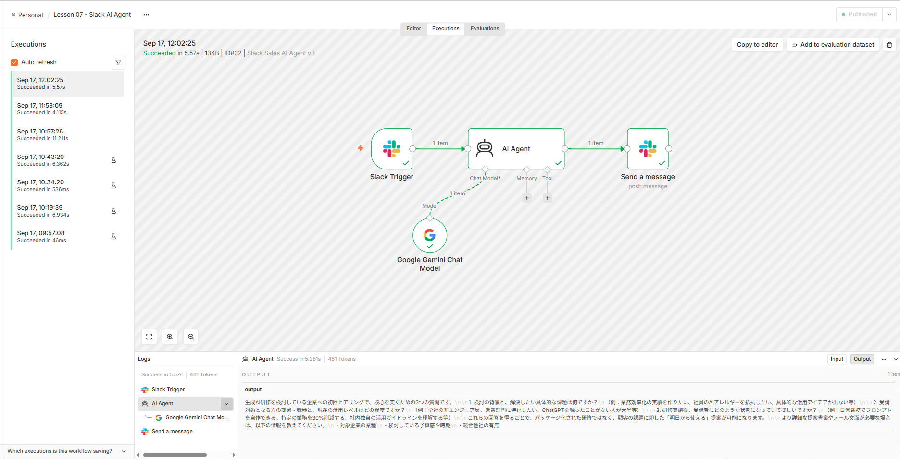

# n8n × Gemini 実践 AI エージェント研修

## 営業提案 AI エージェントを作りながら学ぶ Tool Calling / Human-in-the-loop

n8n と Gemini を利用して、**企業業務で活用できる AI
エージェントを段階的に構築する実践型研修教材**です。

単に LLM へプロンプトを送り文章を生成するのではなく、

- Workflow
- LLM
- AI Agent
- Tool Calling
- Human-in-the-loop
- 外部サービス連携

までを段階的に実装しながら、**「通常の業務自動化」と「AI
エージェント」の違いを理解すること**を目的としています。

題材として、営業担当者の商談準備を支援する
**「営業提案 AI エージェント」** を構築します。

---

## 🎯 この教材のゴール

最終的に、次のような AI エージェントを構築します。

```text
営業担当者
    ↓
「株式会社○○との初回商談を準備して」
    ↓
n8n
    ↓
AI Agent（Gemini）
    │
    ├─ Tool：企業情報を調査
    ├─ Tool：顧客課題を分析
    ├─ Tool：営業提案を作成
    ├─ Tool：商談情報を記録
    └─ Tool：担当者へ通知
    │
    ↓
AI が目的・状況に応じて
必要な Tool を選択
    ↓
営業提案・次のアクションを生成
    ↓
Human-in-the-loop
    ↓
人間による承認
   ↙        ↘
承認        却下
 ↓
外部サービスへ反映
```

重要なのは、処理を単純に上から順番に実行するだけではなく、

> **AI Agent 自身が、目的達成のためにどの Tool を使用するか判断する**

ことです。

---

## 💡 なぜ最初に「普通の Workflow」を学ぶのか

AI Agent を理解するには、まず通常の Workflow
との違いを理解する必要があります。

### 通常の Workflow

```text
入力
 ↓
処理A
 ↓
If
↙  ↘
A    B
```

処理順序や判断条件は、**人間があらかじめ設計**します。

### AI Agent

```text
ユーザーの目的
      ↓
   AI Agent
   ↙  ↓  ↘
Tool A Tool B Tool C
```

AI Agent では、LLM が目的や状況を解釈し、**利用可能な Tool
の中から必要なものを選択**できます。

本教材ではこの違いを、実際に n8n を操作しながら体験します。

---

## 📚 カリキュラム

---

| Lesson                                               | 内容                                   | 主な学習テーマ                                           | 状態        |
| ---------------------------------------------------- | -------------------------------------- | -------------------------------------------------------- | ----------- |
| [Lesson 01](./docs/lesson01-setup.md)                | n8n Community Edition の環境構築       | Docker / n8n                                             | ✅ 完成     |
| [Lesson 02](./docs/lesson02-basic-workflow.md)       | 基本 Workflow の構築                   | Trigger / JSON / Expression / If                         | ✅ 完成     |
| [Lesson 03](./docs/lesson03-gemini-integration.md)   | Gemini を n8n に接続する               | Gemini API / LLM / Prompt                                | ✅ 完成     |
| [Lesson 04](./docs/lesson04-ai-agent.md)             | AI Agent を構築する                    | AI Agent / Chat Model / Tool なし Agent の限界           | ✅ 完成     |
| [Lesson 05](./docs/lesson05-tool-calling.md)         | Tool Calling を実装する                | Code Tool / Tool Calling / Agent による Tool 選択        | ✅ 完成     |
| [Lesson 06](./docs/lesson06-human-in-the-loop.md)    | Human-in-the-loop を実装する           | Chat Trigger / Human Review / 承認・却下 / AI ガバナンス | ✅ 完成     |
| [Lesson 07](./docs/lesson07-slack-sales-ai-agent.md) | Slack と連携した Sales AI Agent を構築 | Slack / OAuth / Webhook / 外部サービス連携               | ✅ 完成     |
| Lesson 08                                            | 営業提案 AI Agent 完成・発展演習       | Agent 設計 / 業務適用                                    | 🚧 制作予定 |

---

## 📦 Workflow サンプルの利用について

本リポジトリの `workflows/` ディレクトリには、各 Lesson で作成した n8n Workflow のサンプル JSON を公開しています。

```text
workflows/
├─ 01-basic-workflow.json
├─ 02-gemini-integration.json
├─ 03-ai-agent.json
├─ 04-tool-calling.json
├─ 05-human-in-the-loop.json
└─ 06-slack-sales-ai-agent.json
```

これらの JSON は n8n に Import して、教材の Workflow を再現するために利用できます。

> **IMPORTANT** 公開用の Workflow JSON からは、セキュリティと環境依存情報の除去を目的として、Credential、Credential ID、Webhook ID、Workflow ID、Instance ID などを削除しています。
> そのため、Import しただけではすべての Workflow がそのまま動作するわけではありません。

Import 後は、各 Lesson の手順に従って、自分の環境で必要な設定を行ってください。

代表的な再設定項目は次のとおりです。

- Gemini API Credential
- Slack Credential
- Slack Channel
- Webhook URL
- その他、利用環境に依存する設定

API キーやアクセストークンなどの秘密情報を JSON や GitHub リポジトリへ直接保存しないでください。

本教材では、

```text
教材を読む
    ↓
Workflow JSON を Import
    ↓
自分の Credential / 環境設定を行う
    ↓
Workflow を実行
    ↓
各 Node の役割やデータの流れを確認する
```

という使い方を想定しています。

---

## 🧠 この教材で学べること

### n8n / Workflow

- Trigger と Node
- Node 間のデータ受け渡し
- JSON
- Expression
- 条件分岐
- Workflow の Import / Export

### 生成 AI

- Gemini との API 連携
- LLM への入力と出力
- Prompt 設計
- 動的データの利用
- LLM を業務 Workflow に組み込む方法

### AI Agent

- Workflow と AI Agent の違い
- AI Agent と Chat Model の関係
- Agent の役割
- Tool Calling
- Code Tool
- Tool Description の設計
- Agent による Tool 選択
- Tool が必要な場合と不要な場合の違い
- Tool を持たない Agent の限界

### AI ガバナンス

- Human-in-the-loop
- AI による外部操作の制御
- 人間による承認・却下
- Tool 実行前の Human Review
- Credential / API キーの安全な管理

---

## 🏗️ 現在の実装

現在、**Lesson 07 まで実装済み**です。

### Lesson 02：通常の Workflow

```text
Manual Trigger
      ↓
 Edit Fields
      ↓
     If
   ↙    ↘
 true  false
```


営業担当者・商談先企業・依頼内容を構造化データとして作成し、企業名が入力されているかを
If Node で判定します。

ここでは AI
を使用せず、**人間が定義したルールによって処理を分岐する従来型
Workflow** を構築しています。

### Lesson 03：Gemini を Workflow から呼び出す

```text
Manual Trigger
      ↓
 Edit Fields
      ↓
Google Gemini
(Message a model)
      ↓
営業提案を生成
```


Edit Fields で作成した業務データを Gemini
へ渡し、営業担当者向けの初回商談準備を生成します。

ここでは、**通常の Workflow の一処理として LLM
を利用する方法**を学びます。

### Lesson 04：AI Agent を構築する

Lesson 04 では、Gemini を直接呼び出す構成から AI Agent
を中心とした構成へ発展させます。

```text
Manual Trigger
      ↓
 Edit Fields
      ↓
   AI Agent
      │
      └── Google Gemini Chat Model
```


AI Agent の Chat Model として Gemini
を接続し、営業担当者の目的をもとに初回商談の準備内容を生成します。

さらに、あえて Tool を接続しない状態で、

```text
株式会社サンプル製造の最新の企業情報を調査し、
その情報をもとに初回商談の提案を作成してください
```

という指示を与えました。


この実験から、

> **AI Agent
> を利用するだけで、外部情報を自由に取得できるようになるわけではない**

ことを確認します。

Lesson 04 の Agent は次の状態です。

```text
             AI Agent
                │
        ┌───────┼───────┐
        ↓       ↓       ↓
 Chat Model   Memory   Tool
        │       ×       ×
     Gemini
```

Agent が外部の情報やシステムを利用する能力は、接続された Tool
によって拡張されます。

この「Tool を持たない Agent の限界」を理解したうえで、Lesson 05 の Tool
Calling へ進みます。

### Lesson 05：Tool Calling を実装する

Lesson 05 では、AI Agent に初めて Tool を接続します。

今回は Tool Calling
の仕組みを明確に確認するため、見積金額と値引率から提案金額を計算する
**Code Tool** を作成しました。

```text
Manual Trigger
      ↓
 Edit Fields
      ↓
   AI Agent
    ↙    ↘
Gemini   Code Tool
 Chat    値引計算
Model
```


例えば、

```text
見積金額850,000円を10%値引きした提案金額を計算し、
初回商談の提案を作成してください
```

という目的を与えると、AI Agent は計算が必要であることを判断し、Code Tool
を呼び出します。

実行ログでは、

```text
AI Agent
 ├─ Google Gemini Chat Model
 ├─ Code Tool
 └─ Google Gemini Chat Model
```

という処理を確認できます。


さらに、Code Tool へ、

```json
{
  "input": "850000,10"
}
```

という値が渡され、

```json
{
  "originalAmount": 850000,
  "discountRate": 10,
  "discountedAmount": 765000
}
```

という計算結果が返されます。


ここで重要なのは、**Tool
が接続されているからといって、必ず実行されるわけではない**ことです。

次に、

```text
株式会社サンプル製造との初回商談で確認すべき質問を3つ提案してください
```

という計算を必要としない目的へ変更しました。

すると Code Tool は実行されず、n8n の実行ログには、

```text
None of your tools were used in this run.
```

と表示されました。


この比較によって、

```text
計算が必要
    ↓
Code Tool を使用

計算が不要
    ↓
Code Tool を使用しない
```

という **AI Agent による Tool 選択**を実際の実行ログから確認できます。

Lesson 04 と Lesson 05 の違いを整理すると、

```text
Lesson 04

AI Agent
    │
    └── Gemini
         ↓
       推論・生成のみ


Lesson 05

AI Agent
    │
    ├── Gemini
    │    └─ 推論・生成
    │
    └── Code Tool
         └─ 計算
```

となります。

Lesson 05 によって、AI Agent
は単に文章を生成するだけではなく、**目的に応じて利用可能な Tool
を選択し、その結果を利用して処理を続ける**構成へ発展しました。

### Lesson 06：Human-in-the-loop を実装する

Lesson 06 では、AI Agent が Tool
を実行する前に、**人間による承認・却下を挟む Human-in-the-loop**
を実装します。

Lesson 05 では、AI Agent が目的に応じて Code Tool
を自律的に選択できることを確認しました。

Lesson 06 では、その Tool
実行をそのまま許可するのではなく、人間が内容を確認してから実行できる構成へ発展させます。

```text
When chat message received
          ↓
       AI Agent
       ↙      ↘
   Gemini   Human review
              ↓
            Chat
        (Send and wait)
              ↓
        承認 / 却下
              ↓
          Code Tool
```


Chat Trigger の Response Mode は `Using Response Nodes` に設定します。

これにより、AI Agent が Tool の実行を要求した際に、Chat
上で人間による確認を待機できます。

例えば、

```text
見積金額850,000円を10%値引きした提案金額を計算してください。
```

と入力すると、AI Agent は Code Tool が必要であると判断します。

しかし、Code Tool はすぐには実行されません。

```text
AI Agent
   ↓
Code Tool の使用を判断
   ↓
Human review
   ↓
人間の回答を待機
```

という状態になります。


#### 承認した場合

`Approve` を選択すると Code Tool が実行されます。

Code Tool には、

```text
850000,10
```

が渡され、

```json
{
  "originalAmount": 850000,
  "discountRate": 10,
  "discountedAmount": 765000
}
```

という結果が返されます。


その結果を Gemini が利用し、最終的に、

```text
見積金額850,000円から10%値引きした提案金額は、765,000円です。
```

という回答を生成します。


#### 却下した場合

一方、`Decline` を選択すると Tool の実行は承認されません。

Human review の実行結果では、

```text
approved: false
```

となっていることを確認できます。


つまり、

```text
AI Agent が Tool を使いたいと判断
              ↓
        Human review
          ↙       ↘
      Approve    Decline
         ↓          ↓
    Tool 実行    Tool を実行しない
```

という制御が可能になります。

これは、AI Agent を企業業務で利用する際の重要な設計です。

AI に判断や Tool
選択を任せながらも、金額変更、データ更新、メール送信、外部システムへの登録など、影響の大きい操作については、**最終的な実行権限を人間に残す**ことができます。

Lesson 06 によって、

> **AI Agent の自律性と、人間による統制を組み合わせる
> Human-in-the-loop**

の基本構成を実装できました。

---

### Lesson 07：Slack と連携した Sales AI Agent

Lesson 07 では、n8n の AI Agent を Slack と接続し、営業担当者が普段利用するチャネルから呼び出せる **Sales AI Agent** を構築します。

```text
営業担当者
    ↓
Slack
@Sales AI Agent
    ↓
Slack Trigger
    ↓
AI Agent
    │
    └── Google Gemini Chat Model
    ↓
Slack
Send a message
    ↓
営業担当者へ回答
```

Slack App、OAuth Scope、Event Subscriptions、Webhook、Cloudflare Tunnel を設定し、ローカル PC 上の n8n が Slack の `app_mention` イベントを受信できる構成を作ります。

また、AI Agent には法人営業支援用の System Message を設定し、Slack のメンション ID を Expression で除去してから Gemini へ渡します。

```text
{{ $json.text.replace(/<@[^>]+>/g, "").trim() }}
```

ローカル環境では Cloudflare Quick Tunnel を利用します。GitHub 上の `compose.yaml` には一時的な Tunnel URL を固定していません。Lesson 07 の手順に従い、Cloudflare Quick Tunnel を起動したあと、自分の環境で `WEBHOOK_URL` を追加します。

```yaml
- WEBHOOK_URL=https://xxxxx.trycloudflare.com/
```

`xxxxx` の部分は、その都度 Cloudflare が発行した自分の URL に置き換えます。

n8n と `cloudflared` の両方が起動している間、Slack から Sales AI Agent を利用できます。



## 🖥️ 開発・実習環境

本教材は以下の環境で制作・動作確認しています。

- Windows 11
- WSL2
- Ubuntu 24.04
- Docker Desktop
- Docker Compose
- n8n Community Edition 2.38.7（動作確認バージョン）
- Gemini API
- Slack
- Cloudflare Tunnel (`cloudflared`)

> **NOTE**
> 本教材のスクリーンショットおよび操作手順は、n8n Community Edition 2.38.7 を基準に作成・動作確認しています。
> n8n は継続的にアップデートされるため、使用するバージョンによって Node 名、設定項目、画面構成などが教材と異なる場合があります。

n8n は Docker コンテナ上で実行します。

教材、スクリーンショット、Workflow JSON などは Windows
側のプロジェクトディレクトリで Git 管理します。

---

## 📁 Repository Structure

```text
n8n-ai-agent/
│
├─ README.md
├─ compose.yaml
├─ .gitignore
│
├─ docs/
│  ├─ lesson01-setup.md
│  ├─ lesson02-basic-workflow.md
│  ├─ lesson03-gemini-integration.md
│  ├─ lesson04-ai-agent.md
│  ├─ lesson05-tool-calling.md
│  ├─ lesson06-human-in-the-loop.md
│  ├─ lesson07-slack-sales-ai-agent.md
│  │
│  └─ images/
│     ├─ 01_n8n_owner_account_setup.png
│     ├─ ...
│     ├─ 56_n8n_tool_not_used.png
│     ├─ 64_n8n_lesson06_empty_workflow.png
│     ├─ ...
│     ├─ 104_n8n_lesson06_decline_approved_false.png
│     ├─ 105_n8n_lesson07_empty_workflow.png
│     ├─ ...
│     └─ 197_n8n_Sales_AI_Agent_v3_Final_Execution.png
│
└─ workflows/
   ├─ 01-basic-workflow.json
   ├─ 02-gemini-integration.json
   ├─ 03-ai-agent.json
   ├─ 04-tool-calling.json
   ├─ 05-human-in-the-loop.json
   └─ 06-slack-sales-ai-agent.json
```

※ スクリーンショット番号 `52` および `57`〜`63` は欠番です。

---

## 🚀 n8n の起動

Docker Desktop
を起動した状態で、プロジェクトディレクトリから実行します。

```powershell
docker compose up -d
```

ブラウザから次へアクセスします。

```text
http://localhost:5678
```

停止する場合は、

```powershell
docker compose down
```

を実行します。

詳しい環境構築手順は、

➡️ [Lesson 01：n8n の環境構築](./docs/lesson01-setup.md)

を参照してください。

---

## 🔐 セキュリティについて

API キー、パスワード、Credential などの秘密情報は GitHub
へ登録しません。

Gemini API の認証情報は n8n の Credential として管理し、API
キーそのものを Workflow JSON や Markdown へ直接記述しない構成とします。

Workflow を GitHub へ公開する前には、Export した JSON
に秘密情報が含まれていないことを確認します。

`.env` などの秘密情報を含むファイルは `.gitignore` の対象とします。

---

## 👨‍🏫 研修教材としての設計

本リポジトリは、完成した AI Agent
を公開するだけではなく、**受講者が段階的に仕組みを理解できる研修教材**として設計しています。

各 Lesson では、

1.  概念を理解する
2.  n8n で実際に操作する
3.  INPUT / OUTPUT を確認する
4.  なぜその処理が必要なのか考える
5.  演習で設定を変更する
6.  完成 Workflow と比較する

という流れで学習します。

特に、

```text
Workflow
   ↓
LLM
   ↓
AI Agent
   ↓
Tool Calling
   ↓
Human-in-the-loop
```

という発展を、一つの営業業務を題材として連続的に体験できる構成としています。

### 「できること」だけでなく「できないこと」も確認する

本教材では、成功する操作だけでなく、AI Agent
の制約や判断も実際に確認します。

Lesson 04 では Tool を持たない Agent に外部情報の調査を要求することで、

```text
AI Agent
≠
自動的にあらゆる外部情報へアクセスできるAI
```

という点を実験から理解します。

Lesson 05 では Tool を追加し、

```text
Tool が必要な依頼
    ↓
Tool を使用

Tool が不要な依頼
    ↓
Tool を使用しない
```

という挙動を比較します。

これにより、単に Tool の接続方法を学ぶだけではなく、

> **AI Agent は目的に応じて利用可能な Tool を選択する**

という Tool Calling
の基本的な考え方を実行ログから理解できる構成としています。

Lesson 06 では、さらに Tool 実行前に Human Review を追加し、

```text
AI が Tool の使用を判断
          ↓
     人間が確認
       ↙    ↘
    承認    却下
     ↓       ↓
   実行    実行しない
```

という制御を体験します。

これにより、AI Agent の自律性だけではなく、

> **どの処理を AI に任せ、どの処理に人間の判断を残すべきか**

という AI ガバナンスの考え方まで学習できる構成としています。

---

## 🔄 発展例

本教材で学ぶ AI Agent の設計は、営業業務以外にも応用できます。

例えば、

- 社内問い合わせ対応 AI Agent
- 新人教育・OJT 支援 AI Agent
- 採用支援 AI Agent
- 業務改善提案 AI Agent
- AI 研修設計 Agent

などへ展開できます。

最終演習では、受講者自身の業務を題材に、

> **「どの業務を Workflow にし、どの判断を AI Agent
> へ任せ、どこに人間の承認を入れるべきか」**

を設計することを目標とします。

---

## 📌 Project Status

**現在：Lesson 07 完成**

Lesson 01〜07 を通して、AI Agent を段階的に発展させてきました。

```text
Lesson 01
n8n 環境構築
    ↓
Lesson 02
通常の Workflow
    ↓
Lesson 03
Gemini / LLM 連携
    ↓
Lesson 04
AI Agent + Gemini
    ↓
Lesson 05
AI Agent + Tool Calling
    ↓
Lesson 06
Human-in-the-loop
    ↓
Lesson 07
Slack / Webhook / 外部サービス連携
```
