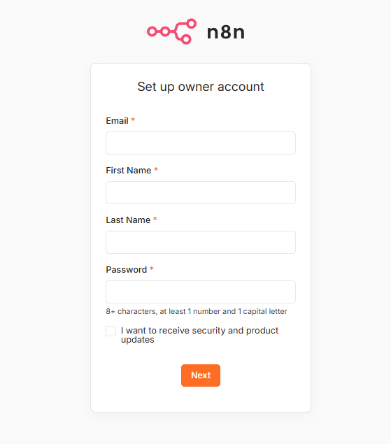
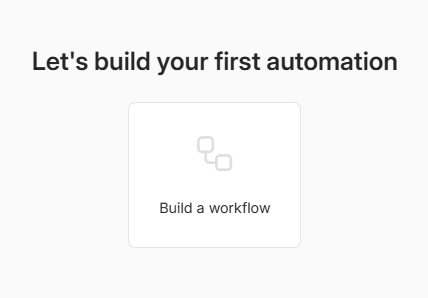
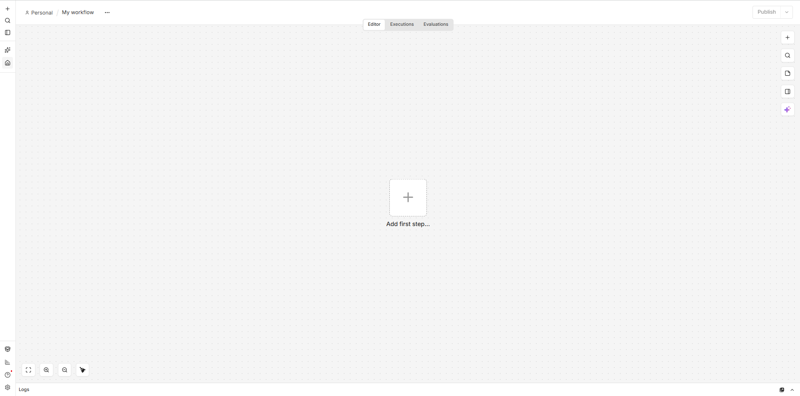

# Lesson 01：n8n の環境構築

## この Lesson のゴール

この Lesson では、Docker を利用して n8n Community Edition をローカル環境に構築します。

完了すると、ブラウザから n8n を起動し、Workflow を作成できる状態になります。

---

## 1. 今回使用する環境

本教材では以下の環境を使用します。

- Windows 11
- WSL2
- Ubuntu 24.04
- Docker Desktop
- Docker Compose
- n8n Community Edition

n8n は Docker コンテナ上で実行し、教材や Workflow の JSON ファイルは Windows 側で管理します。

```text
Windows
│
├─ n8n-ai-agent/
│  ├─ compose.yaml
│  ├─ docs/
│  └─ workflows/
│
└─ Docker Desktop
       ↓
   n8n Container
       ↓
   localhost:5678
```

---

## 2. プロジェクトフォルダを作成する

PowerShell またはコマンドプロンプトから、作業用フォルダを作成します。

```powershell
cd C:\Users\<ユーザー名>
mkdir n8n-ai-agent
cd n8n-ai-agent
```

---

## 3. compose.yaml を作成する

プロジェクト直下に `compose.yaml` を作成します。

```yaml
services:
  n8n:
    image: docker.n8n.io/n8nio/n8n:latest
    container_name: n8n-ai-agent
    restart: unless-stopped
    ports:
      - "5678:5678"
    environment:
      - GENERIC_TIMEZONE=Asia/Tokyo
      - TZ=Asia/Tokyo
      - N8N_ENFORCE_SETTINGS_FILE_PERMISSIONS=true
      - N8N_RUNNERS_ENABLED=true
    volumes:
      - n8n_data:/home/node/.n8n

volumes:
  n8n_data:
```

`n8n_data` という Docker Volume を利用することで、コンテナを停止しても n8n のデータを保持できるようにしています。

---

## 4. n8n を起動する

プロジェクトフォルダで次のコマンドを実行します。

```powershell
docker compose up -d
```

初回は n8n の Docker イメージをダウンロードするため、時間がかかる場合があります。

コンテナの状態を確認したい場合は、次のコマンドを使用できます。

```powershell
docker compose ps
```

---

## 5. n8n へアクセスする

ブラウザで次の URL を開きます。

```text
http://localhost:5678
```

初回起動時には Owner Account の作成画面が表示されます。



メールアドレス、氏名、パスワードを設定します。

> [!IMPORTANT]
> パスワード、API キー、Credential などの秘密情報を、スクリーンショットや GitHub へ公開しないようにしてください。

---

## 6. 最初の Workflow 画面を開く

初期設定が完了すると、最初の Automation を作成できます。



`Build a workflow` を選択すると Workflow Editor が開きます。



ここが、これから AI Agent を構築していくメイン画面です。

---

## 7. n8n と GitHub の役割

今回、n8n と GitHub は異なる役割を持ちます。

| 技術   | 役割                                      |
| ------ | ----------------------------------------- |
| n8n    | Workflow・AI Agent を実際に構築・実行する |
| Docker | n8n の実行環境を構築する                  |
| GitHub | 教材、Workflow、構成図などを公開する      |

n8n はローコード／ノーコードで Workflow を構築できます。

一方、本教材では完成した Workflow を JSON としてエクスポートし、Markdown 教材とともに GitHub で管理します。

---

## 8. Lesson 01 のまとめ

この Lesson では、

- Docker による n8n 環境構築
- n8n Community Edition の起動
- Workflow Editor へのアクセス
- n8n と GitHub の役割

を確認しました。

次の Lesson では、まだ AI を使用しません。

まず通常の Workflow を作り、

**「人間が処理手順を決める Workflow」**

がどのように動くのかを理解します。

その後の Lesson で、この Workflow を AI Agent へ発展させていきます。

➡️ [Lesson 02：基本 Workflow とルールベースの判断](./lesson02-basic-workflow.md)
