# Lesson 02：基本 Workflow とルールベースの判断

## この Lesson のゴール

この Lesson では、AI を使用する前に n8n の基本的な Workflow を作成します。

次の 3 つのノードを使用します。

```text
Manual Trigger
      ↓
 Edit Fields
      ↓
     If
   ↙    ↘
 true  false
```

この Lesson を通じて、

- Trigger
- Node
- JSON
- Expression
- 条件分岐
- ノード間のデータ受け渡し

という n8n の基本概念を理解します。

さらに、後の Lesson で扱う**AI Agent との違い**を考えます。

---

## 1. Workflow とは

Workflow とは、複数の処理をつなぎ合わせて、一連の業務を自動化する仕組みです。

例えば、

```text
メールを受信
    ↓
添付ファイルを取得
    ↓
データを登録
    ↓
担当者へ通知
```

のように処理を組み合わせます。

通常の Workflow では、基本的に**「何を、どの順番で実行するか」を人間があらかじめ設計します。**

この特徴を覚えておいてください。

後の Lesson で AI Agent との重要な違いになります。

---

## 2. Trigger を追加する

Workflow には、処理を開始する「きっかけ」が必要です。

n8n ではこれを **Trigger** と呼びます。

Workflow Editor で `Add first step` をクリックすると、Trigger の候補が表示されます。

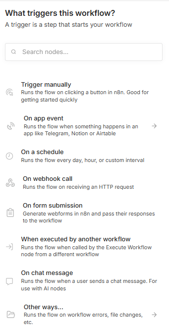

n8n には、

- 手動実行
- アプリのイベント
- スケジュール
- Webhook
- フォーム送信
- チャットメッセージ

など、さまざまな Trigger があります。

今回は学習用なので **Trigger manually** を選択します。

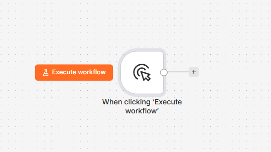

これにより、`Execute workflow` をクリックしたときに Workflow が開始されます。

---

## 3. Node を追加する

Trigger の右側にある `+` をクリックすると、次に実行する Node を追加できます。

n8n では処理内容がカテゴリ別に整理されています。

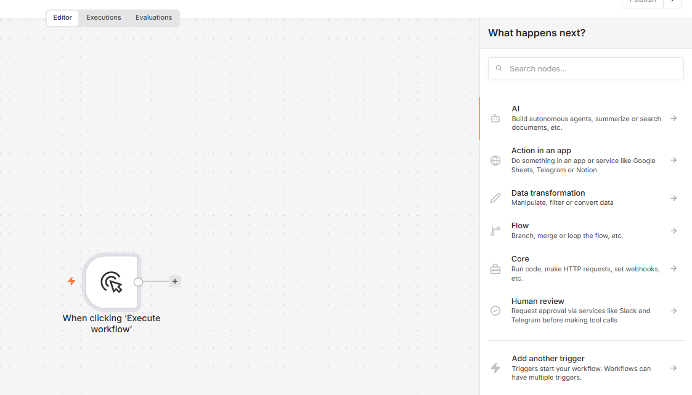

例えば、

- AI
- Action in an app
- Data transformation
- Flow
- Core
- Human review

などがあります。

後の Lesson では **AI** や **Human review** も使用します。

今回はデータを作成するため、`Edit Fields (Set)` を追加します。

---

## 4. Edit Fields で営業データを作る

`Edit Fields` は、Workflow 内で使用するデータを追加・変更する Node です。

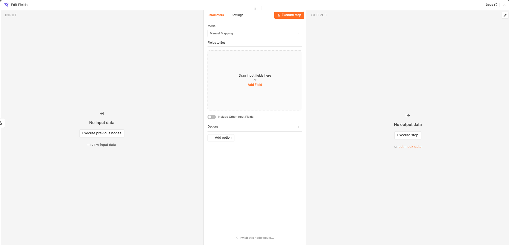

まず `sales_person` を追加します。

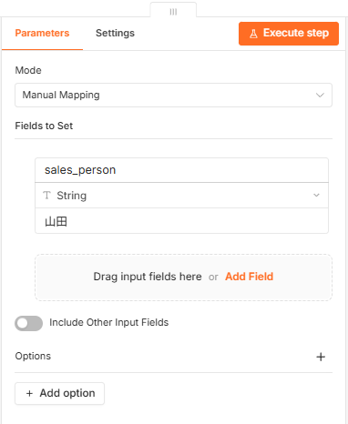

続いて次の 3 項目を設定します。

| Field          | Type   | Value                            |
| -------------- | ------ | -------------------------------- |
| `sales_person` | String | 山田                             |
| `company`      | String | 株式会社 ABC                     |
| `request`      | String | 初回商談の提案を準備してください |

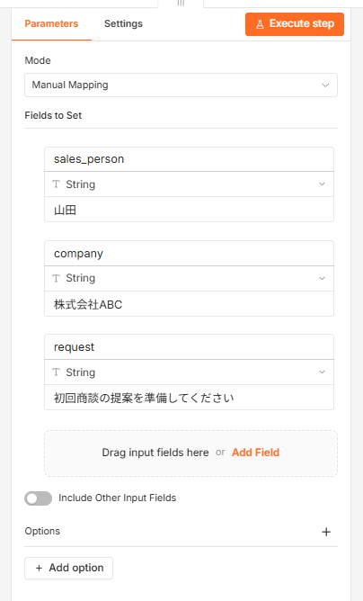

---

## 5. JSON を確認する

`Execute step` を実行すると、OUTPUT にデータが表示されます。

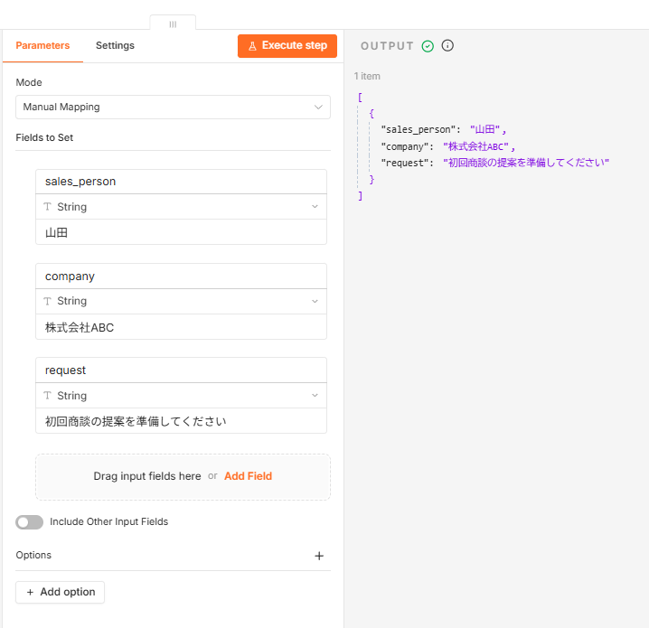

データは概念的には次のような JSON として扱われます。

```json
{
  "sales_person": "山田",
  "company": "株式会社ABC",
  "request": "初回商談の提案を準備してください"
}
```

### JSON とは

JSON は、データを「名前」と「値」の組み合わせで表現する形式です。

例えば、

```json
{
  "company": "株式会社ABC"
}
```

では、

- `company` がデータの名前
- `株式会社ABC` が値

です。

n8n では、このような構造化データを Node から Node へ受け渡しながら処理します。

```text
Node A
  ↓
JSON
  ↓
Node B
  ↓
JSON
  ↓
Node C
```

AI Agent を作るときにも、この考え方は重要です。

---

## 6. If Node を追加する

次に条件分岐を作ります。

`+` から `If` を検索します。

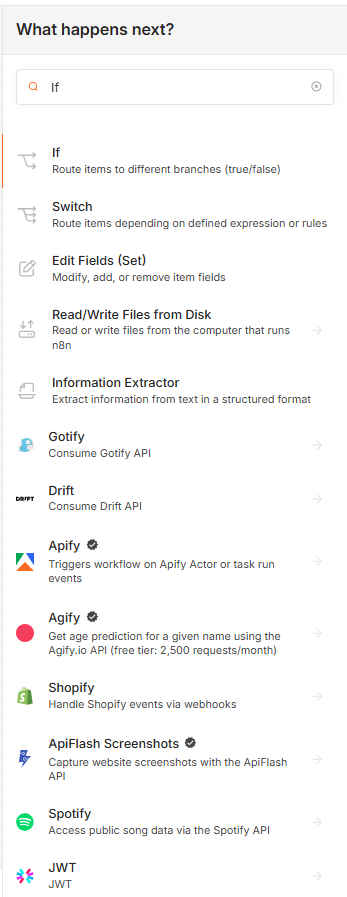

If Node は条件に応じてデータを、

```text
true
```

または、

```text
false
```

へ振り分けます。

---

## 7. 前の Node のデータを利用する

If Node を開くと、左側の INPUT に前の `Edit Fields` のデータが表示されます。

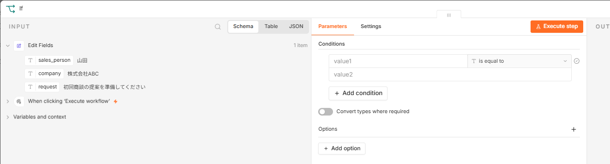

ここが n8n を理解する重要なポイントです。

**前の Node の OUTPUT が、次の Node の INPUT になります。**

今回は `company` を条件判定に使用します。

`company` を条件欄へドラッグすると、次の Expression が設定されます。

```text
{{ $json.company }}
```

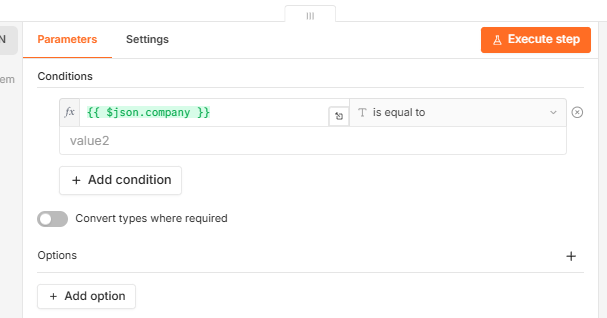

---

## 8. Expression とは

Expression は、Workflow 内のデータを動的に参照する仕組みです。

今回の、

```text
{{ $json.company }}
```

は、

> 現在この Node に渡されている JSON の `company` の値を取得する

という意味です。

今回の入力では、

```text
株式会社ABC
```

が取得されます。

この Expression は、後の AI Agent や Tool Calling でも頻繁に使用します。

---

## 9. 条件を設定する

今回は、

> 企業名が入力されているか

を判定します。

文字列では、さまざまな条件を利用できます。

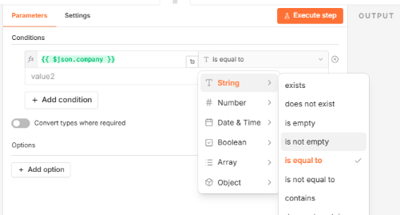

今回は、

```text
is not empty
```

を選択します。

完成した条件は、

```text
{{ $json.company }} is not empty
```

です。

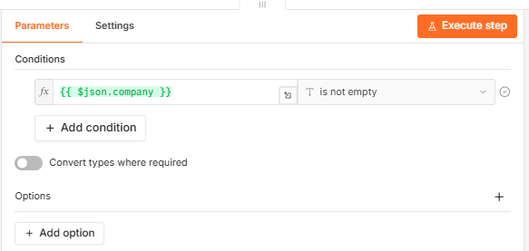

---

## 10. True Branch を確認する

現在、

```text
company = 株式会社ABC
```

なので、`company` は空ではありません。

If Node を実行すると True Branch へデータが流れます。

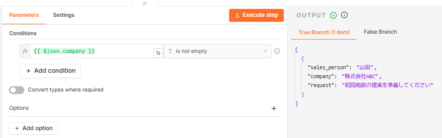

ここで重要なのは、If Node が営業データそのものを書き換えているわけではないことです。

**条件を評価し、データを流す先を選択しています。**

---

## 11. False Branch も試してみる

次に `Edit Fields` の `company` を一時的に空欄にします。

```text
sales_person : 山田
company      :
request      : 初回商談の提案を準備してください
```

もう一度実行すると、

```text
{{ $json.company }} is not empty
```

が成立しないため、False Branch へ流れます。

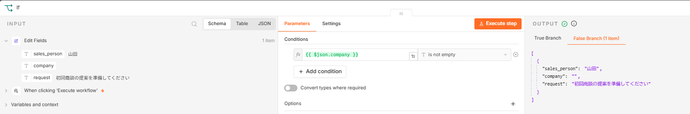

確認後は `company` を、

```text
株式会社ABC
```

へ戻してください。

---

## 12. 完成した Workflow

最終的な Workflow は次の構成です。

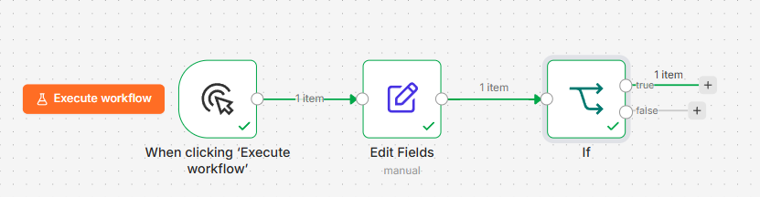

```text
Manual Trigger
      ↓
 Edit Fields
      ↓
     If
   ↙    ↘
 true  false
```

ここまでで、n8n の基本的なデータ処理と条件分岐を体験できました。

---

## 13. 「判断している」のは誰か？

ここで重要な問いがあります。

If Node は確かに「判断」をしています。

しかし、

```text
company is not empty
```

というルールを決めたのは誰でしょうか？

**人間です。**

人間が、

1. `company` を調べる
2. 空欄か確認する
3. True/False へ分岐する

というルールを事前に設計しています。

つまり、従来型 Workflow では、

```text
入力
 ↓
ルールA
 ↓
処理B
 ↓
ルールC
 ↓
処理D
```

のように、処理順序と判断基準を人間が設計します。

---

## 14. AI Agent では何が変わるのか

この後に作成する AI Agent では、考え方が変わります。

例えば営業担当者が、

```text
株式会社ABCとの初回商談を準備してください
```

と依頼したとします。

AI Agent には複数の Tool を用意します。

```text
               AI Agent
             ↙    ↓    ↘
     企業調査Tool 提案Tool 記録Tool
```

従来型 Workflow のように、

```text
必ず企業調査 → 必ず提案 → 必ず記録
```

と人間がすべての処理順序を固定するのではありません。

AI Agent が目的や状況を解釈し、

> 「まず企業情報が必要なので企業調査 Tool を使おう」

などと、必要な Tool を判断します。

これが、この教材でこれから学ぶ **Tool Calling** の重要な考え方です。

---

## 15. Workflow と AI Agent の違い

| 通常の Workflow           | AI Agent                      |
| ------------------------- | ----------------------------- |
| 処理順序を人間が設計      | AI が状況に応じて Tool を選択 |
| If などの条件を人間が定義 | LLM が目的・文脈を解釈        |
| 決められたフローを実行    | 必要な処理を選択して実行      |
| 予測しやすい              | 柔軟だが制御も必要            |

AI Agent の方が常に優れているわけではありません。

ルールが明確な処理では、通常の Workflow の方が安全で予測しやすい場合があります。

一方、

- 自然言語の理解
- 状況に応じた判断
- 複数 Tool からの選択

が必要な業務では AI Agent が有効です。

---

## 16. 演習

### 演習 1

`company` を別の企業名に変更して実行してください。

### 演習 2

If の条件を、

```text
sales_person is not empty
```

へ変更してみてください。

### 演習 3

次の業務を考えてみましょう。

> 問い合わせ内容に応じて「営業」「技術」「請求」の担当部署へ振り分けたい。

通常の Workflow で実装する場合、どのような条件が必要でしょうか？

さらに、

> AI Agent に担当部署を判断させる場合、何が変わるでしょうか？

を考えてみてください。

---

## 17. Workflow JSON

この Lesson の完成 Workflow は次のファイルから確認できます。

```text
workflows/01-basic-workflow.json
```

受講者は、

1. 本 Lesson を見ながら自分で Workflow を作成する
2. 完成後に JSON を Import して比較する

という使い方ができます。

---

## Lesson 02 のまとめ

この Lesson では、

- Trigger
- Node
- Edit Fields
- JSON
- Expression
- If
- True / False Branch
- ルールベースの判断

を学びました。

そして最も重要なのは、

> **通常の Workflow では、人間が処理順序や判断ルールをあらかじめ設計する**

という点です。

次の Lesson から、Gemini を n8n へ接続します。

その後、この営業 Workflow を**AI Agent へ進化**させ、

```text
Workflow
   ↓
LLM
   ↓
AI Agent
   ↓
Tool Calling
   ↓
Human-in-the-loop
```

という流れを段階的に学習していきます。

➡️ **Lesson 03：Gemini を n8n に接続する**
