# Lesson 03：n8n から Gemini を利用する

## この Lesson の目的

Lesson 02 では、n8n の基本的な Workflow を作成しました。

```text
Manual Trigger
      ↓
 Edit Fields
      ↓
     If
```

この Workflow では、処理内容や条件を人間があらかじめ設定していました。

Lesson 03 では、Workflow の途中から Google Gemini を呼び出し、入力された業務データをもとに AI に営業提案を生成させます。

```text
Manual Trigger
      ↓
 Edit Fields
      ↓
Google Gemini
(Message a model)
      ↓
営業提案を生成
```

この段階では、まだ「AI Agent」ではありません。

まずは通常の Workflow から LLM を利用する仕組みを理解し、後続 Lesson で AI Agent との違いを比較します。

---

## 1. Lesson 03 用 Workflow を作成する

新しい Workflow を作成し、名前を次のようにします。

```text
Lesson 03 - Gemini Integration
```

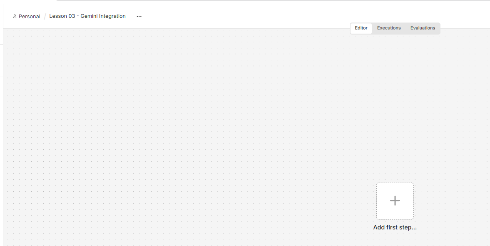

---

## 2. 入力データを作成する

Manual Trigger と Edit Fields を追加します。

Edit Fields では、営業案件を想定した次のデータを作成します。

| Field        | Type   | Value                            |
| ------------ | ------ | -------------------------------- |
| sales_person | String | 山田                             |
| company      | String | 株式会社 ABC                     |
| request      | String | 初回商談の提案を準備してください |

実行すると、Edit Fields から次のノードへ 1 件のデータが渡されます。

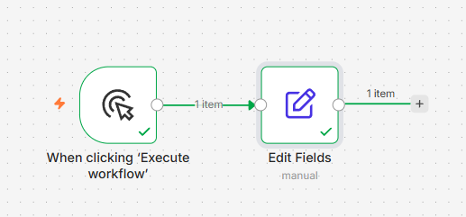

---

## 3. Google Gemini ノードを追加する

Edit Fields の後ろに新しいノードを追加し、

```text
Gemini
```

で検索します。

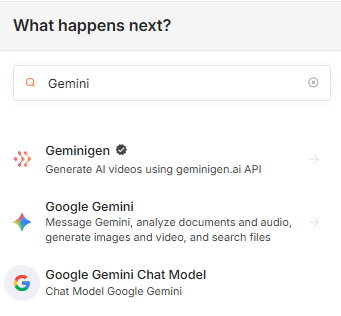

複数の Gemini 関連ノードが表示されます。

この Lesson では **Google Gemini** を使用します。

### Google Gemini と Google Gemini Chat Model の違い

この違いは、後で AI Agent を理解するうえで重要です。

**Google Gemini**

通常の Workflow から Gemini へ直接処理を依頼するときに使用します。

```text
Workflow
   ↓
Google Gemini
   ↓
生成結果
```

**Google Gemini Chat Model**

AI Agent などへ LLM を Chat Model として接続するときに使用します。

```text
AI Agent
   │
   └── Google Gemini Chat Model
```

Lesson 03 では前者を使用します。

---

## 4. Message a Model を選択する

Google Gemini には、画像、音声、動画、テキストなどを扱う複数の Action があります。

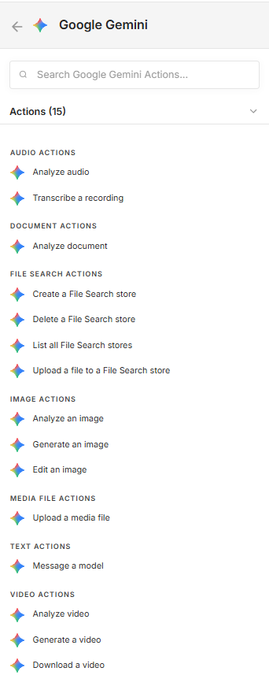

今回は TEXT ACTIONS から、

```text
Message a model
```

を選択します。

初期状態では、Credential、Model、Messages などの設定項目が表示されます。

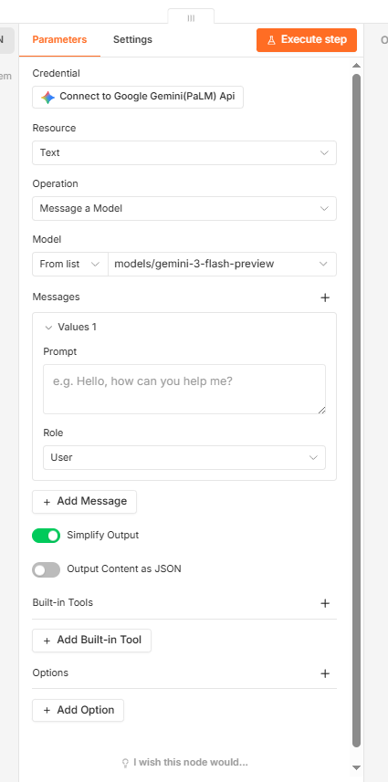

---

## 5. Gemini API Credential を設定する

Google Gemini を利用するには Gemini API の Credential が必要です。

Credential 作成画面では、API Key などを設定します。

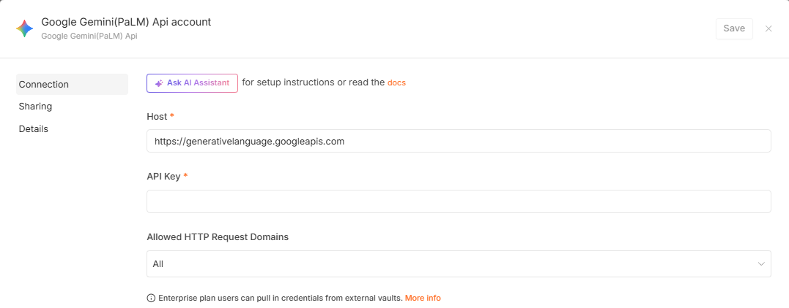

Google AI Studio で、この教材用の API キーを作成します。

例：

```text
n8n-ai-agent
```

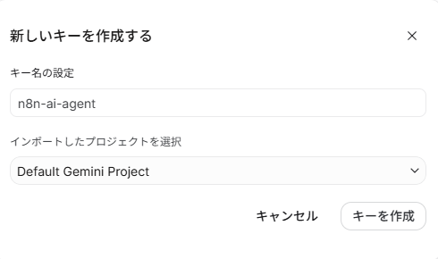

> [!WARNING]
> API キーは GitHub、Markdown、Workflow、スクリーンショットなどへ直接記載しないでください。

API キーは n8n の Credential として管理します。

Credential 設定後、Workflow は次の構成になります。

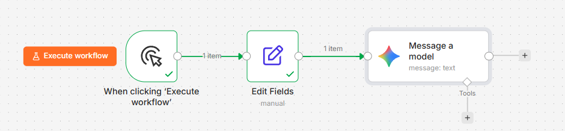

---

## 6. Prompt を作成する

Gemini へ次の Prompt を渡します。

```text
あなたは法人営業を支援するAIアシスタントです。

以下の情報をもとに、初回商談に向けた営業提案を作成してください。

営業担当者：
{{ $json.sales_person }}

商談先企業：
{{ $json.company }}

依頼内容：
{{ $json.request }}

以下の形式で回答してください。

1. 商談の目的
2. ヒアリングすべき項目
3. 想定される顧客課題
4. 提案の方向性
5. 次のアクション
```

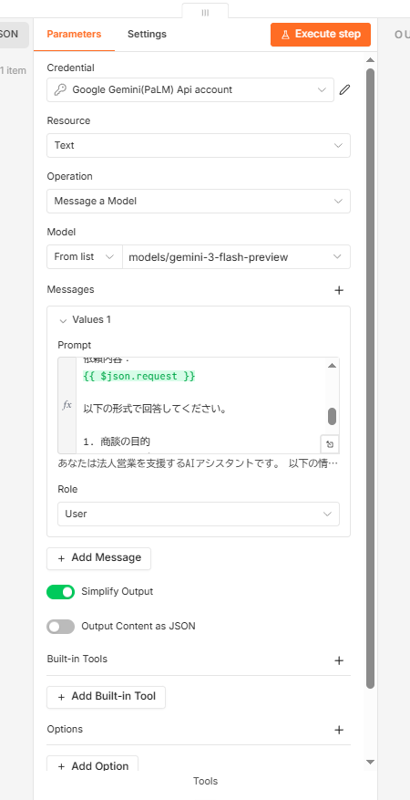

ここでは、Lesson 02 でも使用した n8n の Expression を利用しています。

例えば、

```text
{{ $json.company }}
```

によって、前のノードから渡された `company` の値を Prompt へ挿入できます。

つまり、

```text
Edit Fields
     ↓
JSON
     ↓
Expression
     ↓
Prompt
     ↓
Gemini
```

というデータの流れになります。

---

## 7. Gemini を実行する

Workflow を実行すると、Gemini が入力データをもとに営業提案を生成します。

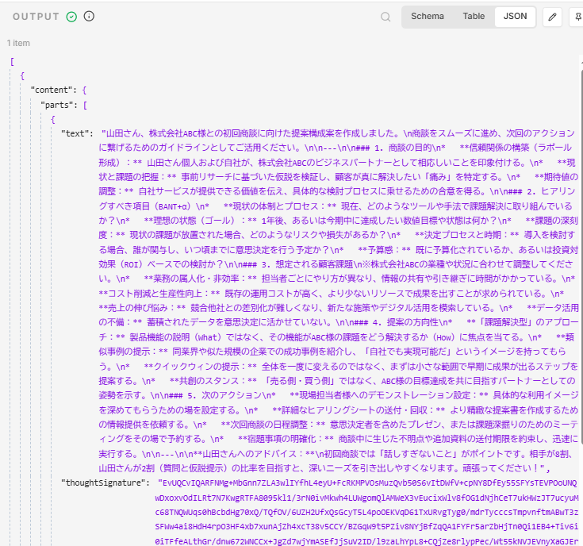

Workflow 全体は次の構成になります。

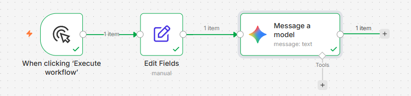

ここまでで、

```text
Manual Trigger
      ↓
 Edit Fields
      ↓
Message a model
      ↓
営業提案生成
```

という LLM を利用した Workflow が完成しました。

---

## 8. 動的な入力を試す

次に入力データを変更します。

```text
sales_person
山田

company
株式会社サンプル製造

request
製造現場の業務効率化に向けた初回商談の提案を準備してください
```

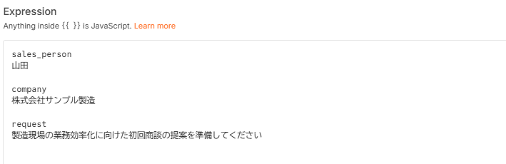

Gemini を再実行すると、入力内容に応じて生成結果も変化します。

例えば今回の実行では、製造現場を想定して、

- 生産管理
- 日報
- 転記作業
- タブレット入力
- AI 画像検査
- 予知保全

などを考慮した営業提案が生成されました。

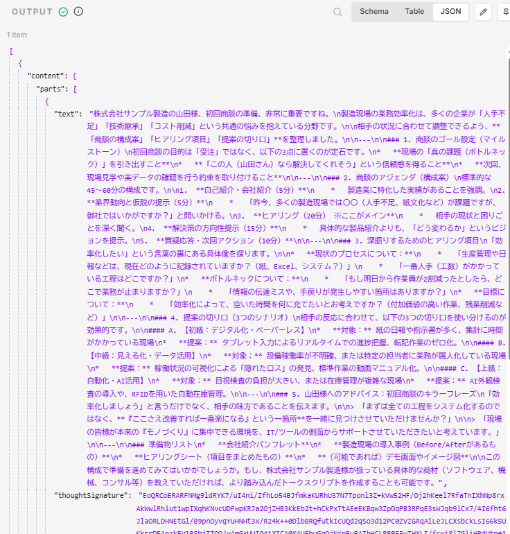

これにより、

```text
業務データ
    ↓
Expression
    ↓
Gemini
    ↓
入力内容に応じた生成結果
```

という仕組みを確認できます。

---

## 9. 外部 AI API ではエラーも発生する

今回の実習中、Gemini API から次のエラーが返されました。

```text
Service unavailable
This model is currently experiencing high demand.
```

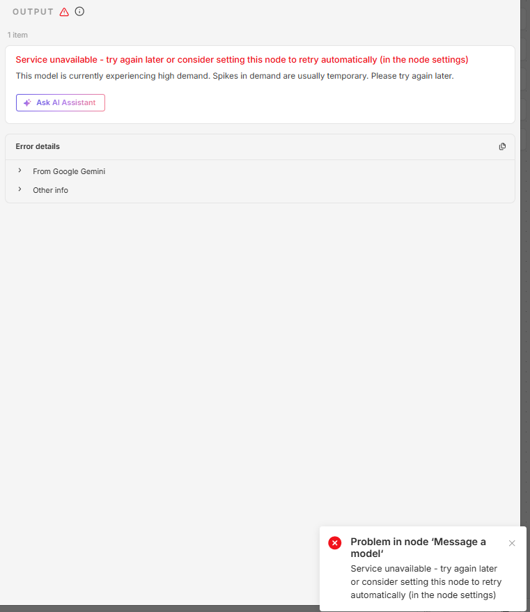

再実行すると正常に処理されました。

これは重要なポイントです。

生成 AI API を業務システムへ組み込む場合、

- API の一時的な高負荷
- Rate Limit
- ネットワーク障害
- タイムアウト

などを想定する必要があります。

本格的な業務利用では、Retry やエラーハンドリングを設計する必要があります。

---

## 10. Workflow を Export する

完成した Workflow は JSON として Export できます。

この教材では次のファイルとして保存しています。

```text
workflows/
└─ 02-gemini-integration.json
```

Workflow JSON には Credential への参照情報が含まれる場合があります。

例：

```json
"credentials": {
  "googlePalmApi": {
    "id": "...",
    "name": "Google Gemini(PaLM) Api account"
  }
}
```

API キーそのものは Workflow JSON へ直接記録せず、n8n の Credential として管理します。

GitHub へ公開する前には、Workflow JSON に API キーなどの秘密情報が含まれていないことを必ず確認してください。

---

## 11. これは AI Agent なのか？

**まだ AI Agent ではありません。**

現在の Workflow は、

```text
Manual Trigger
      ↓
 Edit Fields
      ↓
 Gemini
      ↓
営業提案
```

です。

どのノードを実行するかは、人間があらかじめ Workflow として決めています。

Gemini は渡された Prompt に回答していますが、

> 「目的を達成するために、どの Tool を使うべきか」

を判断しているわけではありません。

次の Lesson では、この構造を AI Agent へ発展させます。

```text
             AI Agent
                │
       ┌────────┼────────┐
       ↓        ↓        ↓
    Tool A   Tool B   Tool C
```

AI Agent 自身が状況に応じて Tool を選択できる構造を作り、

**「LLM を利用した Workflow」と「AI Agent」の違い**

を実装を通して確認します。

---

## この Lesson で学んだこと

- n8n から Gemini API を利用する方法
- Credential による API キー管理
- Message a Model による LLM 呼び出し
- Expression を使った動的 Prompt
- Workflow と LLM 間のデータ受け渡し
- 外部 AI API で発生する一時エラー
- Workflow JSON と Credential の関係
- LLM Workflow と AI Agent の違い

---

## 次の Lesson

**Lesson 04：AI Agent を構築する**

Gemini を単なる生成ノードとして使用するのではなく、AI Agent の Chat Model として接続します。
