# Lesson 04：AI Agent を構築する

## この Lesson の目的

Lesson 03 では、n8n から Google Gemini を呼び出し、入力された業務データをもとに営業提案を生成しました。

```text
Manual Trigger
    ↓
Edit Fields
    ↓
Google Gemini
(Message a model)
    ↓
営業提案を生成
```

ここでは、さらに一歩進めて **AI Agent** を利用します。

AI Agent には、主に次の要素を接続できます。

- Chat Model
- Memory
- Tool

まずは最小構成として、

```text
Manual Trigger
    ↓
Edit Fields
    ↓
AI Agent
    │
    └── Google Gemini Chat Model
```

を構築します。

その後、あえて Tool を接続しない状態で「最新情報を調査してください」と指示し、AI Agent の限界を確認します。

---

## 1. AI Agent 用の Workflow を作成する

新しい Workflow を作成します。

Workflow 名は次のようにします。

```text
Lesson 04 - AI Agent
```

まず Manual Trigger を配置します。

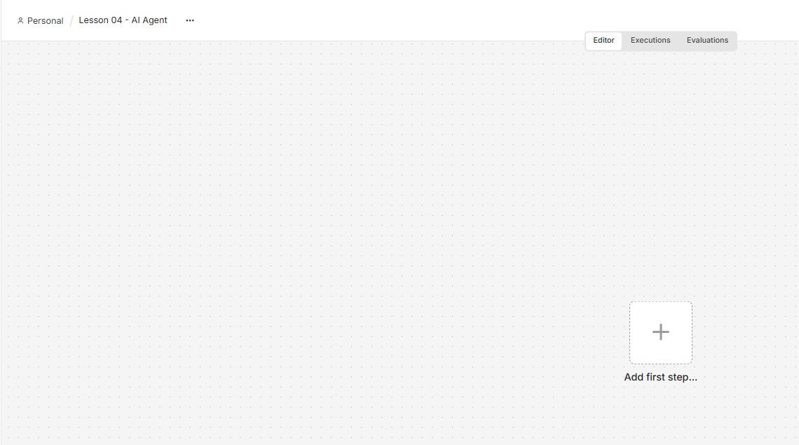

---

## 2. 入力データを作成する

Manual Trigger の後ろに `Edit Fields` ノードを追加します。

営業担当者が AI Agent へ渡す情報として、次のデータを設定します。

| Field        | Value                                        |
| ------------ | -------------------------------------------- |
| sales_person | 山田                                         |
| company      | 株式会社サンプル製造                         |
| goal         | 初回商談に向けて最適な営業準備をしてください |

このデータを AI Agent へ渡します。

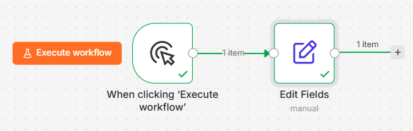

---

## 3. AI Agent ノードを追加する

`Edit Fields` の後ろの `+` をクリックし、ノード検索画面を開きます。

検索欄に、

```text
AI Agent
```

と入力します。

表示された **AI Agent** を選択します。

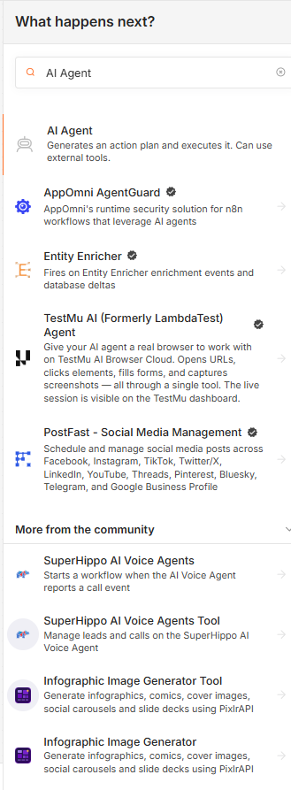

AI Agent は、単純に文章を生成するだけではなく、与えられた目的に対して処理を進めるためのノードです。

---

## 4. Prompt の入力方法を変更する

AI Agent を追加すると、初期状態では `Source for Prompt (User Message)` が、

```text
Connected Chat Trigger Node
```

になっています。

これは Chat Trigger からユーザーのメッセージを受け取る場合に使用する設定です。

今回は Manual Trigger と Edit Fields からデータを渡すため、

```text
Define below
```

へ変更します。

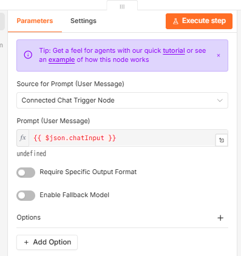

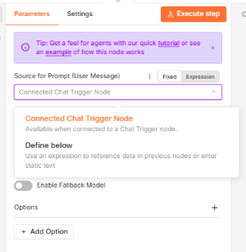

---

## 5. AI Agent への Prompt を作成する

Prompt には、Edit Fields から渡されたデータを利用します。

例：

```text
あなたは法人営業を支援するAIエージェントです。

以下の情報をもとに、営業担当者が初回商談に向けて
行うべき準備を考えてください。

営業担当者：
{{ $json.sales_person }}

企業名：
{{ $json.company }}

目的：
{{ $json.goal }}

営業担当者が次に取るべき行動を、具体的に提案してください。
```

`{{ }}` の部分では、前のノードから渡されたデータを参照しています。

`Define below` を選択し、Prompt を入力します。

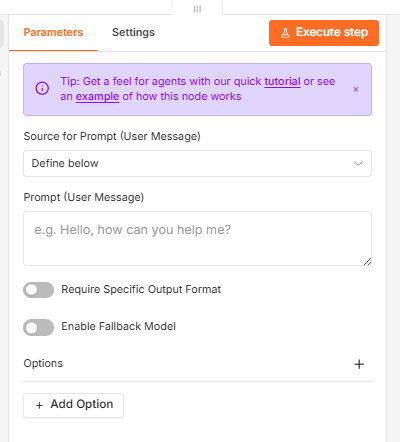

入力データが Expression によって Prompt へ展開されることを確認します。

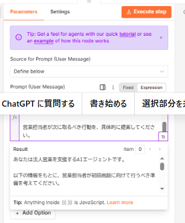

---

## 6. Chat Model を接続する

AI Agent だけでは、自然言語を処理する LLM がまだ接続されていません。

AI Agent 下部の、

```text
Chat Model
```

にある `+` をクリックします。

Language Models の一覧から、

```text
Google Gemini Chat Model
```

を選択します。

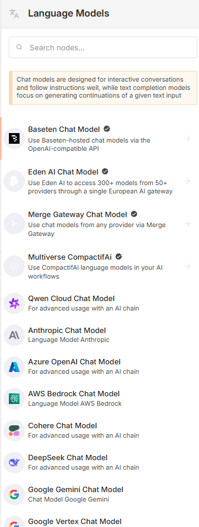

AI Agent では、Agent 本体と LLM が分離されています。

```text
AI Agent
    │
    └── Chat Model
```

この Chat Model として Gemini を利用します。

---

## 7. Gemini モデルを設定する

Google Gemini Chat Model の設定画面を開きます。

Lesson 03 で作成した Credential を再利用できます。

Credential：

```text
Google Gemini(PaLM) Api account
```

利用する Gemini モデルを選択します。

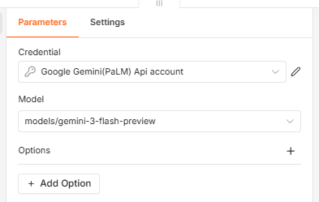

Credential を Workflow ごとに作成する必要はありません。

n8n の Credential として認証情報を管理することで、複数の Node や Workflow から同じ Credential を再利用できます。

```text
n8n Credential
      │
      ├── Google Gemini
      │   （Lesson 03）
      │
      └── Google Gemini Chat Model
          （Lesson 04）
```

これで AI Agent と Gemini を接続する準備ができました。

---

## 8. 最小構成の AI Agent

現在の Workflow は次の構成です。

```text
Manual Trigger
    ↓
Edit Fields
    ↓
AI Agent
    │
    └── Google Gemini Chat Model
```

n8n 上では、AI Agent と Google Gemini Chat Model がモデル用の接続線でつながります。

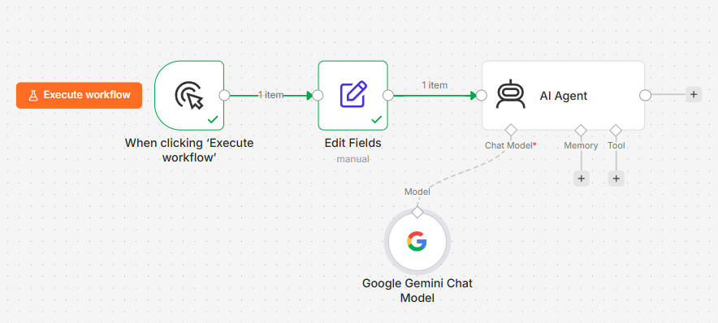

この時点では、

```text
Chat Model → 接続済み
Memory     → 未接続
Tool       → 未接続
```

です。

この段階では、Gemini を Chat Model として利用できますが、Agent が利用できる外部 Tool はまだありません。

---

## 9. AI Agent を実行する

`Execute workflow` をクリックします。

Workflow が正常に実行されると、各ノードに成功を示すチェックが表示されます。

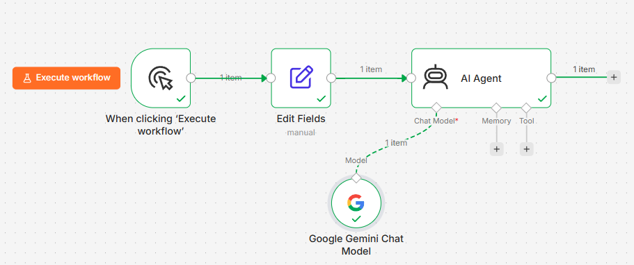

AI Agent の Output を確認します。

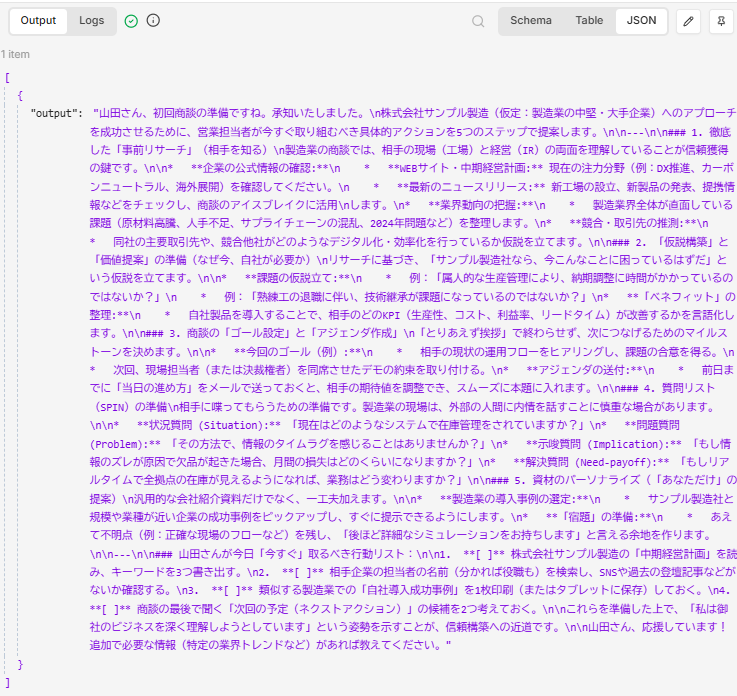

結果は次のような JSON 形式で取得できます。

```json
[
  {
    "output": "AI Agentが生成した営業準備の提案..."
  }
]
```

これで、

```text
業務データ
    ↓
AI Agent
    ↓
Gemini
    ↓
営業準備の提案
```

という処理が実現できました。

---

# 10. AI Agent なら最新情報を調査できるのか？

ここで重要な実験をします。

Edit Fields の `goal` を次の内容へ変更します。

```text
株式会社サンプル製造の最新の企業情報を調査し、
その情報をもとに初回商談の提案を作成してください
```

一見すると、AI Agent が Web を検索して最新情報を取得してくれそうに見えます。

再び Workflow を実行します。

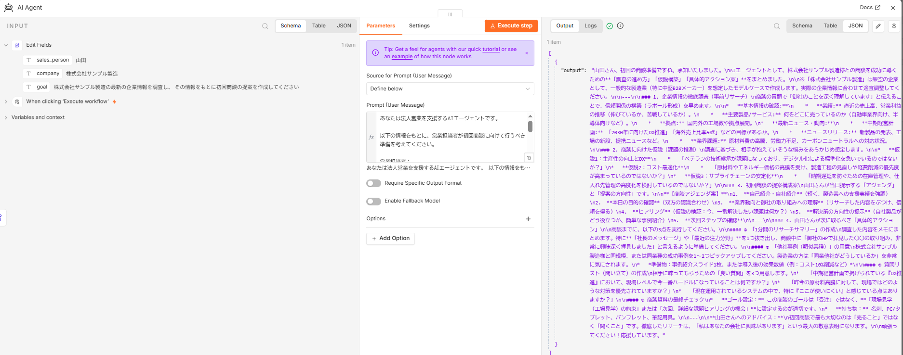

AI Agent は営業提案を生成しました。

しかし、ここで重要な点があります。

**この AI Agent には Web 検索を行う Tool を接続していません。**

そのため、今回の Workflow だけを根拠として「Web を検索して最新企業情報を取得した」と判断することはできません。

---

# 11. AI Agent と Tool の関係

現在の AI Agent は次の状態です。

```text
             AI Agent
                │
       ┌────────┼────────┐
       ↓        ↓        ↓
 Chat Model   Memory    Tool
       │        ×        ×
    Gemini
```

Chat Model は接続されていますが、Tool はありません。

つまり AI Agent は、

- 目的を解釈する
- 情報を整理する
- 仮説を考える
- 提案を文章化する

といった処理はできます。

一方、今回構築した Workflow では、外部システムに対して、

- Web を検索する
- CRM を参照する
- データベースを検索する
- メールを送信する
- 外部 API を呼び出す

といった操作を行う Tool をまだ与えていません。

---

# 12. AI Agent は「何でもできる AI」ではない

ここが AI Agent を理解するうえで重要なポイントです。

```text
LLM
↓
文章を生成する

AI Agent + LLM
↓
目的を解釈して処理を組み立てる

AI Agent + LLM + Tools
↓
必要なToolを利用して
外部の情報やシステムと連携する
```

AI Agent ノードを配置しただけで、あらゆる情報へアクセスできるわけではありません。

**Agent が外部に対して実行できる能力は、接続された Tool によって拡張されます。**

---

# 13. Lesson 03 との違い

Lesson 03 では、

```text
入力
 ↓
Gemini
 ↓
出力
```

という LLM 呼び出しを作成しました。

Lesson 04 では、

```text
入力
 ↓
AI Agent
 ↓
Chat Model
 ↓
出力
```

という Agent 構成へ変更しました。

ただし、現時点では Tool がないため、AI Agent の能力はまだ限定されています。

---

# 14. 次の Lesson

次の Lesson では、AI Agent へ **Tool** を接続します。

```text
                  AI Agent
                     │
           ┌─────────┴─────────┐
           ↓                   ↓
  Gemini Chat Model          Tool
           │                   │
        推論・生成          外部処理
           └─────────┬─────────┘
                     ↓
                  結果生成
```

AI Agent 自身が、目的に応じて Tool を利用する **Tool Calling** を実装します。

これによって、

> AI が文章を生成する Workflow

から、

> AI が目的に応じて利用可能な Tool を選択・実行する Workflow

へ発展させます。

---

## この Lesson で学んだこと

- n8n の AI Agent ノード
- AI Agent と Chat Model の関係
- Google Gemini Chat Model の接続
- 動的データを Agent へ渡す方法
- AI Agent の基本的な実行方法
- Tool を持たない AI Agent の限界
- AI Agent と Tool Calling の関係

次の Lesson では、実際に Tool を接続して AI Agent の能力を拡張します。
