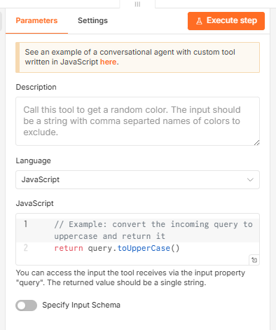
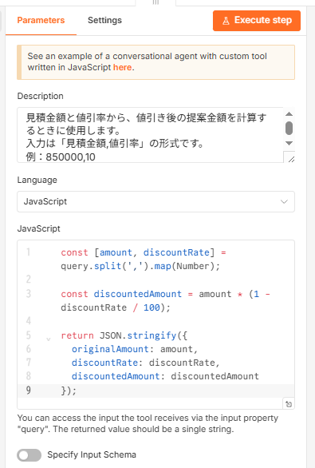
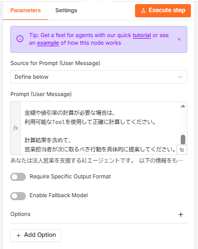
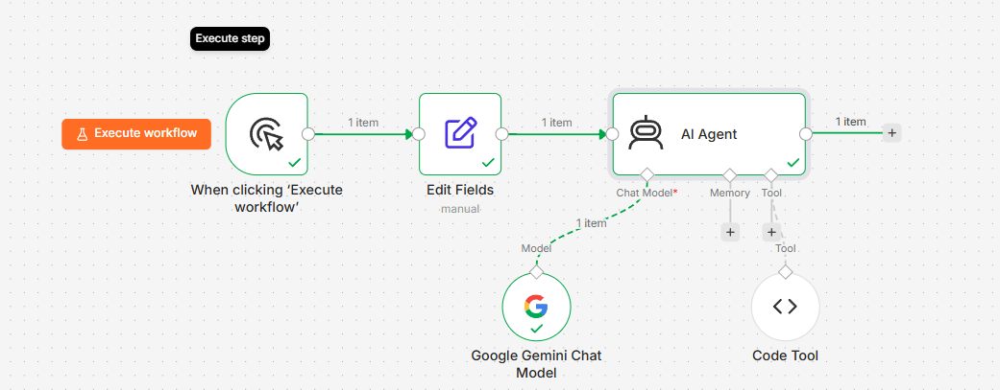
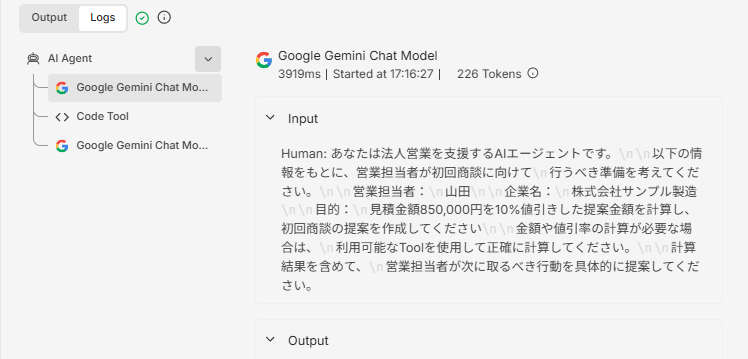
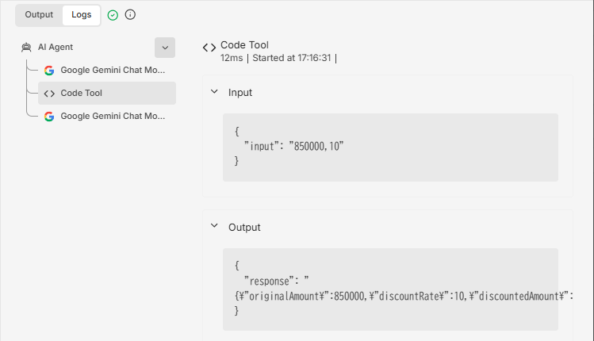
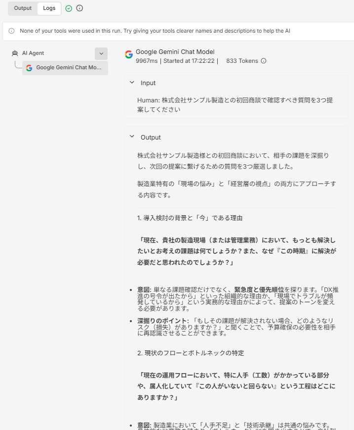

# Lesson 05：Tool Calling を実装する

## この Lesson の目的

Lesson 04 では、n8n の AI Agent に Google Gemini Chat Model を接続しました。

```text
Manual Trigger
    ↓
Edit Fields
    ↓
AI Agent
    │
    └── Google Gemini Chat Model
```

これによって AI Agent は、入力された目的を解釈し、営業担当者が取るべき行動を提案できるようになりました。

しかし、Lesson 04 の AI Agent には外部処理を実行するための **Tool** がありませんでした。

Lesson 05 では、AI Agent に Tool を追加します。

```text
Manual Trigger
    ↓
Edit Fields
    ↓
AI Agent
    │
    ├── Google Gemini Chat Model
    │
    └── Code Tool
```

そして、

> **AI Agent が依頼内容を判断し、必要な場合だけ Tool を選択・実行する**

という **Tool Calling** の基本動作を確認します。

---

## 1. Lesson 05 用の Workflow を作成する

Lesson 04 の Workflow を複製し、Workflow 名を次のように変更します。

```text
Lesson 05 - Tool Calling
```

基本構成は Lesson 04 と同じです。

```text
Manual Trigger
    ↓
Edit Fields
    ↓
AI Agent
    │
    └── Google Gemini Chat Model
```

ここへ新しく Tool を追加します。

---

## 2. Tool を追加する

AI Agent の下部には、主に次の接続先があります。

```text
Chat Model
Memory
Tool
```

`Tool` の `+` をクリックすると、AI Agent から利用できる Tool の一覧が表示されます。

今回は Tool Calling の仕組みを分かりやすく確認するため、

```text
Code Tool
```

を選択します。

Code Tool では、JavaScript または Python を利用して、AI Agent から呼び出せる独自の処理を作成できます。

---

## 3. 値引き計算 Tool を作成する

`Code Tool` を選択すると、次の設定画面が表示されます。



今回は営業業務を想定し、

> 見積金額と値引率から、値引き後の提案金額を計算する

Tool を作成します。

Code Tool の `Description` に次の内容を設定します。

```text
見積金額と値引率から、値引き後の提案金額を計算するときに使用します。
入力は「見積金額,値引率」の形式です。
例：850000,10
```

Description は単なる説明文ではありません。

AI Agent が、

> 「この目的を達成するために、この Tool を使うべきか」

を判断するための重要な情報になります。

Language は、

```text
JavaScript
```

を選択します。

JavaScript には次のコードを設定します。

```javascript
const [amount, discountRate] = query.split(",").map(Number);

const discountedAmount = amount * (1 - discountRate / 100);

return JSON.stringify({
  originalAmount: amount,
  discountRate: discountRate,
  discountedAmount: discountedAmount,
});
```

設定後は次のようになります。



この Tool に、

```text
850000,10
```

が渡されると、

```json
{
  "originalAmount": 850000,
  "discountRate": 10,
  "discountedAmount": 765000
}
```

という計算結果を返します。

今回は最小構成で Tool Calling の仕組みを確認するため、`Specify Input Schema` は OFF のままとします。

---

## 4. AI Agent の Prompt を変更する

AI Agent の Prompt を、Tool を利用できることを前提とした内容へ変更します。

```text
あなたは法人営業を支援するAIエージェントです。

以下の情報をもとに、営業担当者が初回商談に向けて
行うべき準備を考えてください。

営業担当者：
{{ $json.sales_person }}

企業名：
{{ $json.company }}

目的：
{{ $json.goal }}

金額や値引率の計算が必要な場合は、
利用可能なToolを使用して正確に計算してください。

計算結果を含めて、
営業担当者が次に取るべき行動を具体的に提案してください。
```

ここでは、

```text
Code Toolを必ず使用してください
```

とは指示していません。

重要なのは、

```text
金額や値引率の計算が必要な場合は、
利用可能なToolを使用してください
```

としている点です。

どの Tool を使用するかは AI Agent に判断させます。

---

## 5. Tool Calling を発生させる

`Edit Fields` の `goal` を次のように設定します。

```text
見積金額850,000円を10%値引きした提案金額を計算し、
初回商談の提案を作成してください
```

Workflow は次の構成になります。

```text
Manual Trigger
      ↓
 Edit Fields
      ↓
   AI Agent
    ↙    ↘
Gemini   Code Tool
Chat     値引計算
Model
```

AI Agent に Google Gemini Chat Model と Code Tool が接続された状態を確認します。



完成した Workflow 全体は次のようになります。



---

## 6. Workflow を実行する

`Execute workflow` をクリックします。

AI Agent は依頼内容から、

```text
850,000円
10%値引き
```

という計算が必要であることを判断します。

そして、利用可能な Tool の中から値引き計算用の Code Tool を利用します。

最終的な回答には、

```text
元の見積金額：850,000円
値引率：10%
提案金額：765,000円
```

という計算結果が反映されました。

ただし、最終回答に `765,000円` と表示されただけでは、AI Agent が本当に Tool を使用したとは断定できません。

LLM 自身が計算した可能性もあるためです。

そこで、次に実行ログを確認します。

---

## 7. Tool Calling の実行ログを確認する

AI Agent の `Logs` を開きます。

実行履歴には次のような処理が表示されました。

```text
AI Agent
 ├─ Google Gemini Chat Model
 ├─ Code Tool
 └─ Google Gemini Chat Model
```



この実行履歴から、

1. Gemini が依頼内容を解釈する
2. AI Agent が Code Tool を呼び出す
3. Code Tool の結果を受け取る
4. Gemini が結果を利用して最終回答を生成する

という処理が行われたことを確認できます。

通常の Workflow のように、

```text
Gemini
 ↓
Code
 ↓
Gemini
```

という順番を人間が固定したわけではありません。

Code Tool は AI Agent の Tool として接続されています。

AI Agent が依頼内容を判断した結果、必要な Tool として Code Tool が選択されました。

---

## 8. Code Tool に渡されたデータを確認する

Logs から `Code Tool` を選択すると、Tool に渡された Input と Output を確認できます。

今回、AI Agent は Code Tool に次の入力を渡しました。

```json
{
  "input": "850000,10"
}
```



つまり AI Agent は依頼内容から、

```text
見積金額 = 850000
値引率 = 10
```

を読み取り、Code Tool が必要とする、

```text
850000,10
```

という形式へ変換して Tool を呼び出しました。

Code Tool は、

```json
{
  "originalAmount": 850000,
  "discountRate": 10,
  "discountedAmount": 765000
}
```

という計算結果を返します。

AI Agent はその結果を受け取り、最終的な営業提案に利用します。

この一連の処理が **Tool Calling** です。

---

## 9. Tool は毎回実行されるのか？

ここで、もう一つ重要な実験をします。

Code Tool を接続したまま、`goal` を次の内容へ変更します。

```text
株式会社サンプル製造との初回商談で確認すべき質問を3つ提案してください
```

今回は計算処理が必要ありません。

Workflow を再び実行し、Logs を確認します。

すると、実行履歴には Google Gemini Chat Model のみが表示され、Code Tool は呼び出されませんでした。

さらに n8n には、

```text
None of your tools were used in this run.
```

と表示されます。



つまり、

> **Tool が接続されているからといって、毎回 Tool が実行されるわけではありません。**

AI Agent が目的を解釈し、Tool が必要かどうかを判断しています。

---

## 10. 通常の Workflow と Tool Calling の違い

通常の Workflow では、処理順序を人間が設計します。

```text
入力
 ↓
処理A
 ↓
Code
 ↓
処理B
```

Code ノードを処理経路に接続すれば、設計された経路に従って処理されます。

一方、今回の AI Agent は次の構成です。

```text
             AI Agent
                 │
        ┌────────┴────────┐
        ↓                 ↓
Gemini Chat Model      Code Tool
        │                 │
     推論・生成           計算
        └────────┬────────┘
                 ↓
              最終回答
```

AI Agent は依頼内容に応じて、Tool を利用するかどうかを判断します。

今回の実験では、

```text
値引き計算が必要
      ↓
Code Tool を使用
```

となりました。

一方、

```text
質問を3つ提案
      ↓
計算不要
      ↓
Code Tool を使用しない
```

となりました。

この違いが Tool Calling の重要なポイントです。

---

## 11. Tool の Description が重要な理由

AI Agent が Tool を適切に選択するためには、Tool の Description が重要です。

例えば今回、

```text
見積金額と値引率から、値引き後の提案金額を計算するときに使用します。
```

と説明しました。

これによって AI Agent は、

```text
850,000円を10%値引き
        ↓
値引き計算が必要
        ↓
利用可能なToolを確認
        ↓
値引き計算用のCode Toolを選択
        ↓
Code Toolを呼び出す
```

という処理を行うことができます。

Tool を設計するときには、

- 何をする Tool なのか
- どのような場合に使用するのか
- どのような入力を受け取るのか
- どのような結果を返すのか

を明確にすることが重要です。

---

## 12. Lesson 04 との違い

Lesson 04 では、

```text
入力
 ↓
AI Agent
 ↓
Gemini
 ↓
回答
```

でした。

Lesson 05 では、

```text
入力
 ↓
AI Agent
 ├─ Gemini
 └─ Code Tool
 ↓
回答
```

となりました。

AI Agent が単に LLM を利用するだけではなく、**目的達成に必要な処理を Tool に依頼できるようになった**ことが大きな違いです。

さらに今回、

```text
Toolが必要な依頼
    ↓
Toolを使用

Toolが不要な依頼
    ↓
Toolを使用しない
```

という違いも実際の実行ログから確認できました。

---

## 13. AI Agent に Tool を与える意味

AI Agent の能力は、接続する Tool によって拡張できます。

例えば今後、

```text
AI Agent
 │
 ├─ Web検索 Tool
 ├─ Google Sheets Tool
 ├─ CRM Tool
 ├─ Email Tool
 ├─ Slack Tool
 └─ 独自API Tool
```

といった構成にできます。

これによって、

```text
考える
```

だけだった AI から、

```text
考える
 ↓
必要なToolを選ぶ
 ↓
外部処理を実行する
 ↓
結果を受け取る
 ↓
次の行動を決める
```

AI Agent へ発展させることができます。

---

## 14. Human-in-the-loop が必要になる理由

Tool Calling によって AI Agent が外部処理を実行できるようになると、新しい課題も発生します。

例えば、

```text
AI Agent
 ↓
メール送信 Tool
 ↓
顧客へメール送信
```

という構成の場合、AI Agent の判断だけで顧客へメールを送ってよいとは限りません。

そこで、

```text
AI Agent
 ↓
処理内容を作成
 ↓
人間による確認
 ↙       ↘
承認      却下
 ↓
Tool実行
```

という仕組みが重要になります。

これが **Human-in-the-loop** です。

AI Agent に外部システムを操作する権限を与える場合は、処理の影響度に応じて人間による確認・承認を組み込むことが重要です。

---

## 15. 次の Lesson

次の Lesson では、Tool Calling をさらに発展させ、

```text
AI Agent
    ↓
実行内容を作成
    ↓
人間による承認
  ↙         ↘
承認        却下
 ↓
外部処理を実行
```

という **Human-in-the-loop** の考え方を学びます。

AI Agent にすべての操作を任せるのではなく、

> **どこまで AI に任せ、どこから人間が確認するべきか**

という企業での AI 活用に重要な設計を扱います。

---

## この Lesson で学んだこと

- AI Agent に Tool を接続する方法
- Code Tool の作成
- Tool Description の役割
- AI Agent から Tool へデータを渡す仕組み
- Tool Calling の実行ログ
- Tool が必要な場合と不要な場合の違い
- 通常の Workflow と Tool Calling の違い
- AI Agent の能力を Tool で拡張する考え方
- Human-in-the-loop が必要になる理由

Lesson 05 では、AI Agent が単に文章を生成するだけでなく、

> **目的に応じて利用可能な Tool を選択し、その結果を使って処理を続ける**

という AI Agent の重要な動作を確認しました。
