# Lesson 06：Human-in-the-loop ― AI エージェントに人間の承認を組み込む

Lesson 05 では、AI Agent が必要に応じて Code Tool を呼び出し、値引き後の提案金額を自動計算するワークフローを作成しました。

しかし、実際の業務では AI にすべての操作を自動実行させることが適切とは限りません。

たとえば、

- 顧客へのメール送信
- データベースの更新
- 見積・値引き処理
- ファイルの削除
- 外部システムへの登録

など、業務への影響が大きい処理では、**AI が Tool を実行する前に人間が確認する仕組み**が重要になります。

この Lesson では、n8n の **Human review** を利用して、

> AI Agent が Tool を使おうとする  
> → 人間に承認を求める  
> → Approve なら Tool を実行  
> → Decline なら Tool を実行しない

という Human-in-the-loop（HITL）の仕組みを構築します。

---

## 1. この Lesson で作るもの

今回は、営業担当者が Chat から次のように依頼する AI エージェントを作成します。

```text
見積金額850,000円を10%値引きした提案金額を計算してください。
```

AI Agent は値引き計算が必要だと判断すると Code Tool を利用しようとします。

ただし、Code Tool をすぐには実行しません。

Human review を利用して、人間に承認を求めます。

```text
ユーザー
   ↓
Chat Trigger
   ↓
AI Agent
   ↓
Toolを利用したい
   ↓
Human review
   ↓
人間が確認
  ↙       ↘
Approve   Decline
   ↓         ↓
Tool実行   Tool実行なし
```

このように、AI Agent の自律性を活かしながら、重要な処理には人間の判断を組み込むことができます。

---

## 2. 新しいワークフローを作成する

新しいワークフローを作成し、名前を次のようにします。

```text
Lesson 06 - Human in the Loop
```

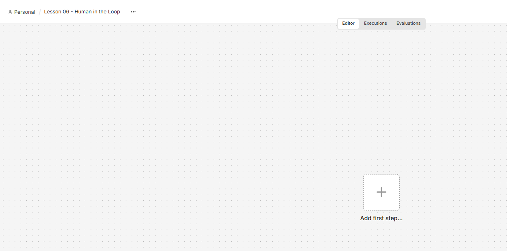

---

## 3. Chat Trigger を追加する

今回はユーザーとの対話と Human review を Chat 上で行うため、Manual Trigger ではなく **Chat Trigger** を使用します。

最初のノードとして Chat を検索します。

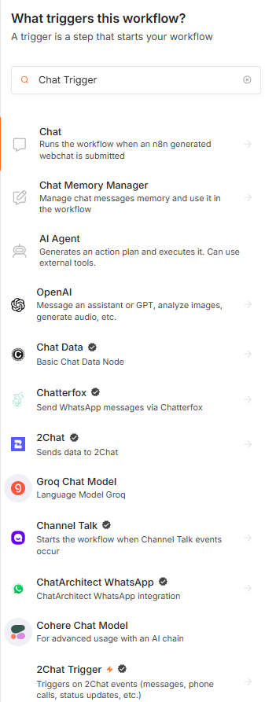

Chat の Trigger から、

```text
On new Chat event
```

を選択します。

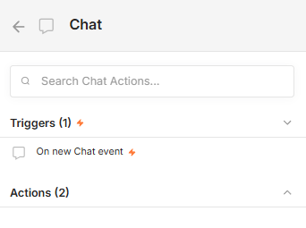

Chat Trigger が追加されます。

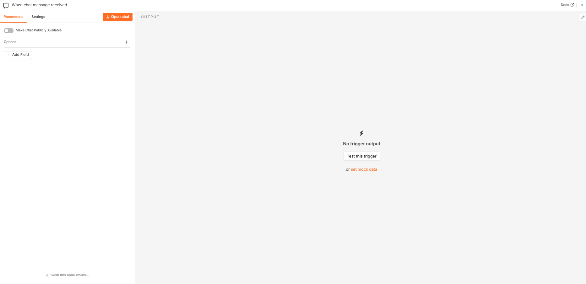

---

## 4. Response Mode を変更する

Human review で Chat を利用する場合、Chat Trigger の Response Mode を変更します。

Options から、

```text
Response Mode
```

を追加します。

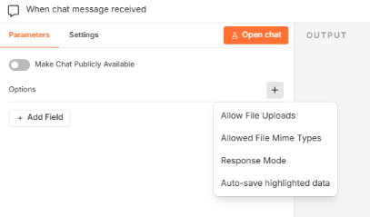

初期状態では、

```text
When Last Node Finishes
```

になっています。

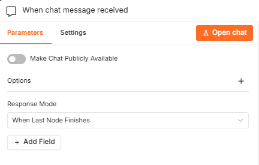

Response Mode を開くと、複数の選択肢が表示されます。

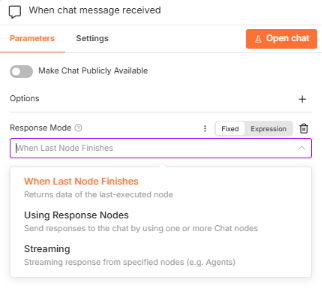

今回は、

```text
Using Response Nodes
```

を選択します。

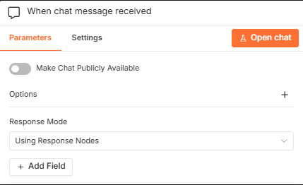

これにより、ワークフロー内の Chat ノードを利用して、承認要求や最終回答をユーザーへ送信できるようになります。

設定後の Chat Trigger は次のようになります。

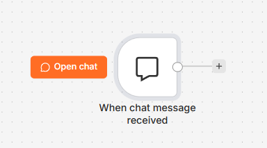

---

## 5. AI Agent を追加する

Chat Trigger の後ろに **AI Agent** を追加します。

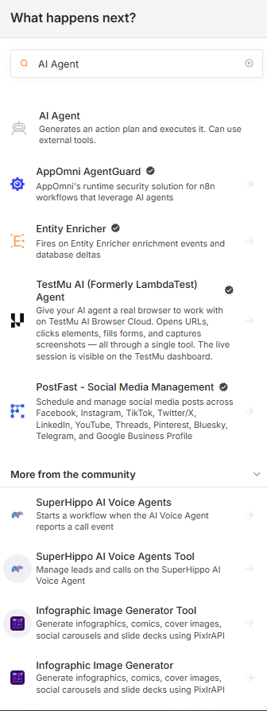

AI Agent を追加すると、Chat Trigger から受け取ったメッセージを User Message として利用できます。

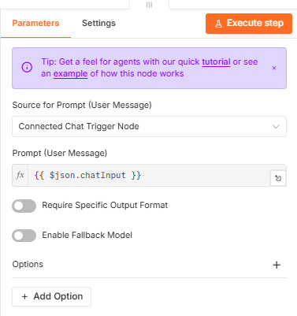

Chat Trigger と AI Agent を接続します。

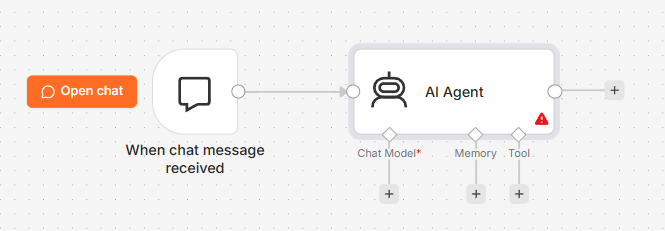

---

## 6. Gemini Chat Model を接続する

AI Agent の `Chat Model` に LLM を接続します。

今回は Lesson 04・05 と同様に **Google Gemini Chat Model** を使用します。

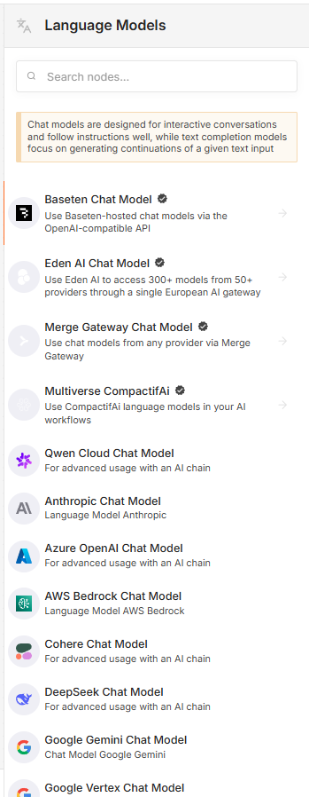

Google Gemini Chat Model を選択し、使用する Credential と Model を設定します。

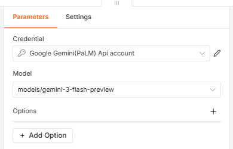

AI Agent と Gemini Chat Model が接続されます。

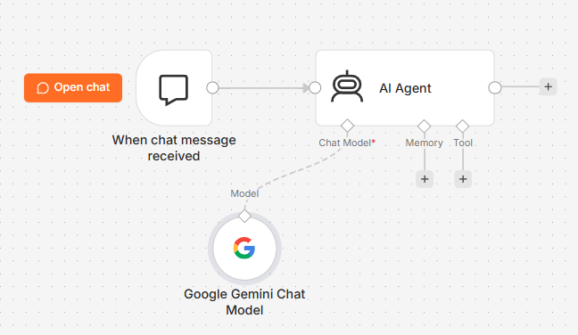

---

## 7. 値引き計算用 Code Tool を作成する

次に、AI Agent が利用する値引き計算 Tool を作成します。

AI Agent の `Tool` から Tool 一覧を開き、**Code Tool** を追加します。

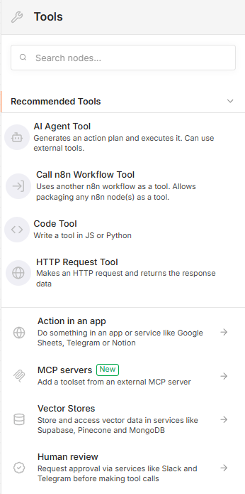

Code Tool の Description には次のように入力します。

```text
見積金額と値引率から、値引き後の提案金額を計算するときに使用します。
入力は「見積金額,値引率」の形式です。
例：850000,10
```

Description は、AI Agent が「どのような場合にこの Tool を使うべきか」を判断するための重要な情報です。

Code Tool の JavaScript には次のコードを設定します。

```javascript
const [amount, discountRate] = query.split(",").map(Number);

const discountedAmount = amount * (1 - discountRate / 100);

return JSON.stringify({
  originalAmount: amount,
  discountRate: discountRate,
  discountedAmount: discountedAmount,
});
```

このコードでは、

```text
850000,10
```

という入力を受け取った場合、

```json
{
  "originalAmount": 850000,
  "discountRate": 10,
  "discountedAmount": 765000
}
```

という計算結果を返します。

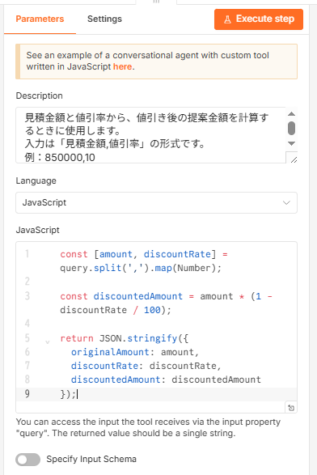

---

## 8. Human review を追加する

ここからが Lesson 06 の中心です。

AI Agent の Tool 追加画面から、

```text
Human review
```

を選択します。

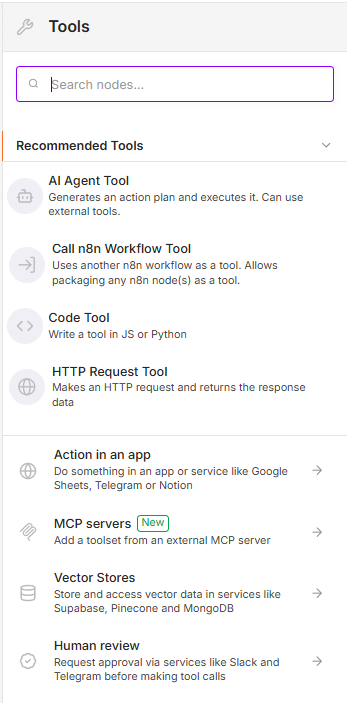

Human review では、承認に利用するサービスを選択できます。

今回の Lesson では外部サービスの Credential を追加せずに実験できるよう、**Chat** を利用します。

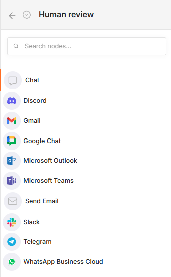

Chat を選択すると Human review 用の Chat ノードが作成されます。

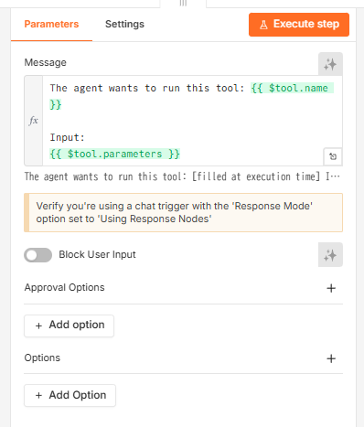

---

## 9. Approve / Decline を設定する

Human review では、AI が Tool を利用しようとしたときの承認方法を設定できます。

`Type of Approval` を開きます。

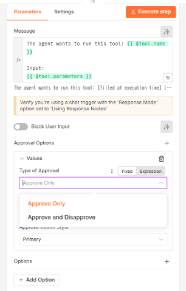

今回は、

```text
Approve and Disapprove
```

を選択します。

これにより、

```text
Approve
Decline
```

の 2 つのボタンが表示されるようになります。

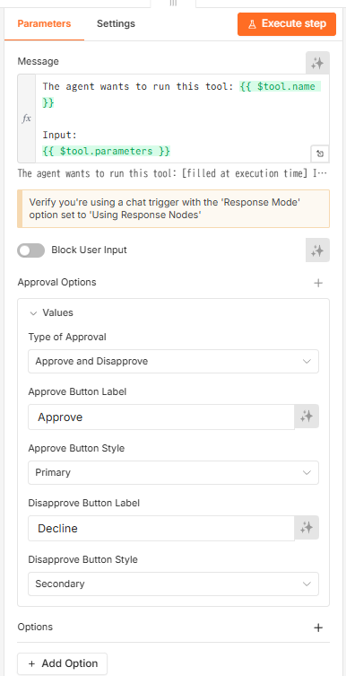

---

## 10. Human review の対象 Tool を接続する

Human review の下側にある `Tool` 接続から Code Tool を接続します。

重要なのは、Code Tool を AI Agent へ直接接続するのではなく、**Human review を経由させること**です。

最終的に次のような構成になります。

```text
AI Agent
   │
   ├── Gemini Chat Model
   │
   └── Human review
          │
         Chat
          │
       Code Tool
```

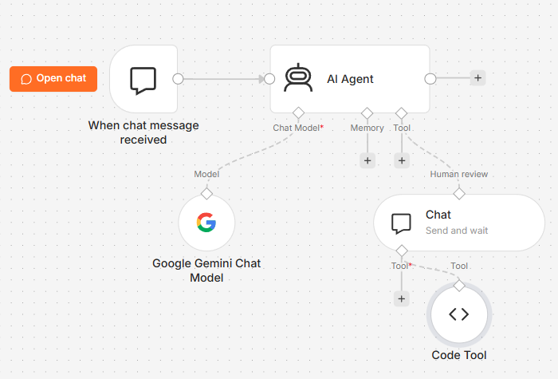

これにより、AI Agent が Code Tool を利用しようとしても、人間が承認するまで実行されません。

---

## 11. Human review をテストする

`Open chat` を開きます。

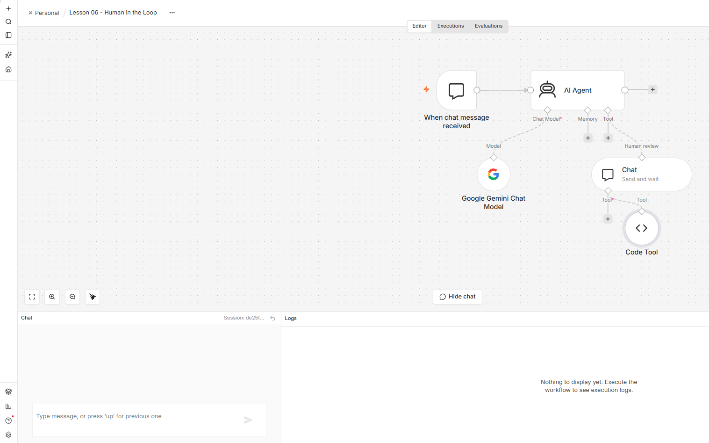

次のメッセージを入力します。

```text
見積金額850,000円を10%値引きした提案金額を計算してください。
```

AI Agent は値引き計算に Code Tool が必要だと判断します。

しかし、Code Tool はすぐには実行されません。

Chat に次のような Human review が表示されます。

```text
The agent wants to run this tool: Code_Tool

Approve
Decline
```

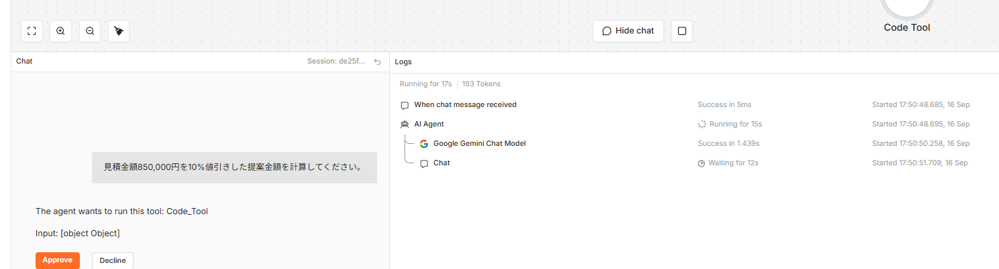

この時点でワークフローは、人間の判断を待って停止しています。

これが Human-in-the-loop です。

---

## 12. Approve した場合

まず `Approve` を選択します。

すると Human review によって Code Tool の実行が許可されます。

Code Tool には、

```text
850000,10
```

が渡されます。

実行結果は次のようになります。

```json
{
  "originalAmount": 850000,
  "discountRate": 10,
  "discountedAmount": 765000
}
```

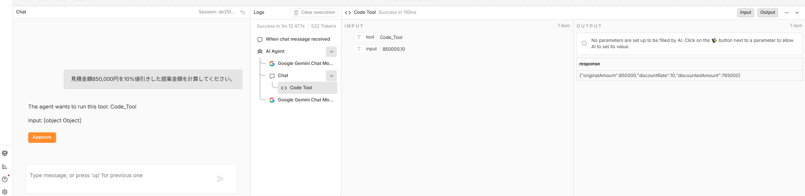

つまり、

```text
850,000円 × (1 - 10 / 100)
= 765,000円
```

と計算されました。

AI Agent は Tool の実行結果を受け取り、最終回答を生成します。

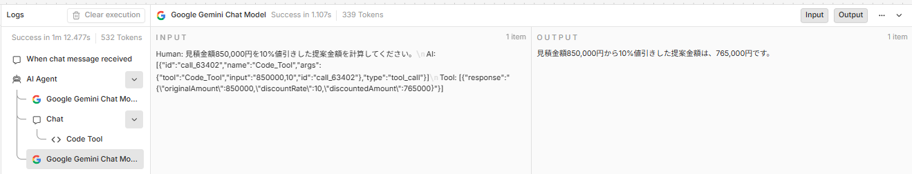

---

## 13. 最終回答を Chat へ返す

Chat Trigger の Response Mode を `Using Response Nodes` にしたため、AI Agent の最終回答をユーザーへ返す Chat ノードを追加します。

Chat の Action から、

```text
Send a message
```

を選択します。

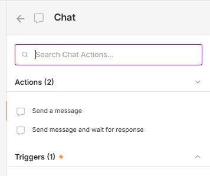

Message には次の Expression を設定します。

```text
{{ $json.output }}
```

これにより、AI Agent が生成した `output` を Chat へ送信します。

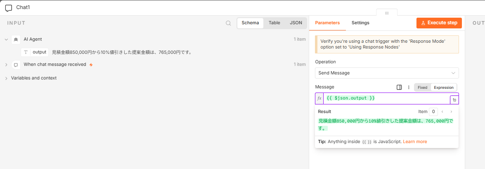

完成したワークフローは次の構成になります。

```text
When chat message received
        ↓
     AI Agent ─────────────→ Chat（Send Message）
       │
       ├── Google Gemini Chat Model
       │
       └── Human review
              ↓
        Chat（Send and wait）
              ↓
          Code Tool
```

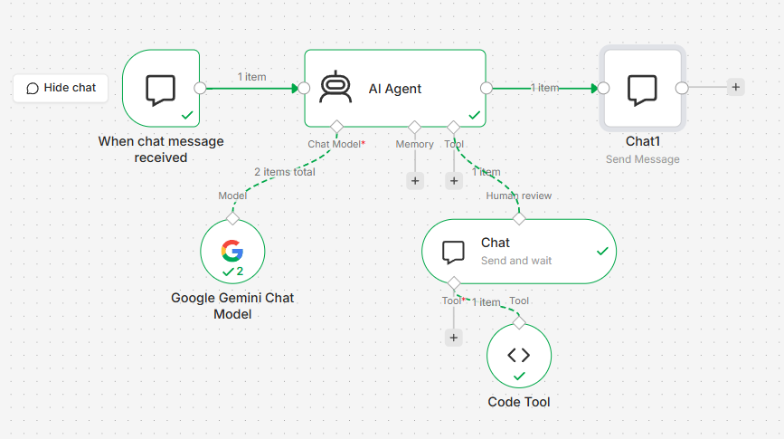

---

## 14. Approve ルートの完成確認

もう一度 Chat から、

```text
見積金額850,000円を10%値引きした提案金額を計算してください。
```

と依頼します。

Human review で `Approve` を選択すると Code Tool が実行され、最終的に Chat へ、

```text
見積金額850,000円から10%を値引きした提案金額は、765,000円です。
```

と回答されます。

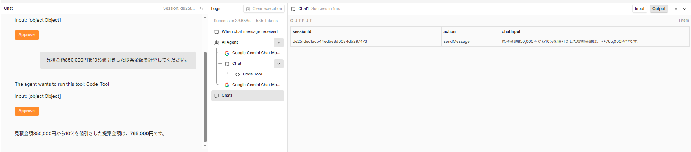

これで、

```text
ユーザーの依頼
↓
AI Agent
↓
Tool利用を判断
↓
Human review
↓
Approve
↓
Code Tool実行
↓
Geminiが最終回答を生成
↓
Chatへ回答
```

という一連の処理が完成しました。

---

## 15. Decline した場合

次に Human review で `Decline` を選択します。

この場合、Code Tool は実行されません。

実行ログを見ると、Approve 時には存在していた Code Tool の実行が、Decline 時には存在しないことを確認できます。

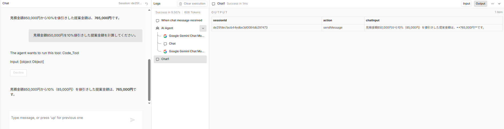

Human review の Output を確認すると、

```text
approved = false
```

になっています。

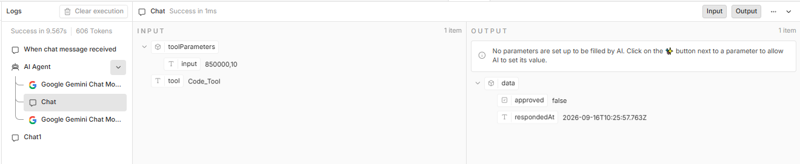

つまり、

```text
AI Agent
↓
Code Toolを実行したい
↓
Human review
↓
Decline
↓
approved = false
↓
Code Toolは実行されない
```

という制御が行われています。

---

## 16. Decline しても AI が回答できる場合がある

今回のテストでは、Decline によって Code Tool は実行されませんでしたが、Gemini 自身が計算を行い、

```text
765,000円
```

という回答を生成しました。

これは Human-in-the-loop を理解するうえで重要なポイントです。

今回構築した Human review は、

> AI のすべての回答を禁止・許可する仕組み

ではありません。

Human review が制御しているのは、

> **指定した Tool を実行してよいかどうか**

です。

そのため、

```text
Decline
↓
Code Toolは実行されない
↓
AI Agentは処理を継続
↓
LLM自身で回答可能なら回答する
```

という動作になる場合があります。

実際の業務で「人間が却下した場合は処理そのものを終了したい」という要件がある場合は、Tool の承認だけではなく、ワークフロー全体の分岐や停止条件も設計する必要があります。

---

## 17. Human-in-the-loop が重要な理由

AI Agent の大きな特徴は、状況を判断して Tool を自律的に利用できることです。

しかし、AI に強い権限を与えるほど、誤った判断による業務への影響も大きくなります。

たとえば、

```text
AI Agent
↓
顧客情報を判断
↓
メール送信Tool
↓
顧客へ自動送信
```

というワークフローでは、AI の判断だけで顧客へメールが送られてしまいます。

Human review を組み込めば、

```text
AI Agent
↓
メールを送信したい
↓
Human review
↓
担当者が内容を確認
↓
Approve
↓
メール送信
```

という安全性を考慮した設計が可能になります。

これは、

- 顧客へのメール送信
- 見積・値引き
- 契約関連処理
- データ更新
- ファイル削除
- 外部 API への登録
- 社内システムへの書き込み

など、実際の企業業務で特に重要になります。

---

## 18. Lesson 06 で学んだこと

この Lesson では、次の内容を学びました。

- Chat Trigger による AI Agent との対話
- `Using Response Nodes` の利用
- AI Agent と Gemini Chat Model の接続
- Code Tool による値引き計算
- Human review の追加
- `Approve and Disapprove` の設定
- Human review 経由での Tool 実行
- Approve 時の Tool 実行
- Decline 時の Tool 実行停止
- Chat ノードによる最終回答
- AI Agent に人間の判断を組み込む考え方

Lesson 05 では、

```text
AI Agent
↓
Toolを自律的に選択
↓
Tool実行
```

という Tool Calling を学びました。

Lesson 06 では、さらに一歩進めて、

```text
AI Agent
↓
Toolを利用したい
↓
Human review
↓
人間が判断
↓
Tool実行
```

という**人間と AI が協調する AI エージェント**を構築しました。

---

## 次の Lesson

Lesson 07 では、ここまで作成した AI Agent をさらに実際の業務に近づけます。

Human-in-the-loop で学んだ「AI が判断し、人間が重要な処理を確認する」という考え方をベースに、外部サービスとの連携を取り入れた AI エージェントへ発展させます。
