# Lesson 07：Slack と連携した Sales AI Agent を構築する

## この Lesson の目的

Lesson 06 では、AI Agent に Human-in-the-loop を組み込み、Tool
の実行前に人間が承認・却下できる仕組みを作成しました。

Lesson 07 では、n8n の外部サービス連携を学びます。

今回は Slack をユーザーインターフェースとして利用し、Slack で AI Agent
をメンションすると、n8n がメッセージを受け取り、Gemini で回答を生成して
Slack へ自動返信する **Sales AI Agent** を構築します。

```text
営業担当者
    ↓
Slack
「@n8n Sales AI Agent
 初回商談で確認すべき項目を教えて」
    ↓
Slack Trigger
    ↓
AI Agent
    │
    └── Google Gemini Chat Model
    ↓
Slack
Send a message
    ↓
営業担当者へ回答
```

この Lesson では、AI Agent の構築だけでなく、

- Slack App
- OAuth Scope
- Event Subscriptions
- Webhook
- Test URL / Production URL
- Workflow の Publish
- System Message

など、**AI Agent
を実際の業務チャネルへ接続するための仕組み**を学びます。

---

## 1. Lesson 07 用の Workflow を作成する

新しい Workflow を作成し、名前を次のようにします。

```text
Lesson 07 - Slack Sales AI Agent
```

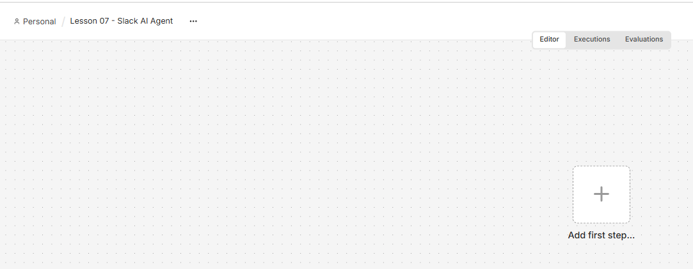

今回は Slack へのメンションをきっかけに Workflow を開始するため、最初の
Node として Slack Trigger を追加します。

Slack の Trigger 一覧から、

```text
Bot / App Mention
```

を選択します。


Slack Trigger が追加されます。


---

## 2. Slack Credential を作成する

Slack Trigger から Slack Workspace へ接続するため、Credential
を作成します。


n8n の Slack Credential では、Slack App
から取得する認証情報を利用します。

そのため、次に Slack App を作成します。

> \[!IMPORTANT\] Bot User OAuth Token、Signing Secret、Client Secret
> などの認証情報は、GitHub や教材へ公開しないでください。

---

## 3. Slack App を作成する

Slack API の `Your Apps` を開き、新しい App を作成します。

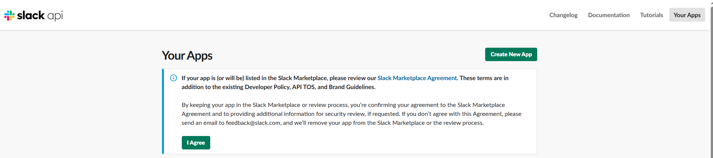

`From scratch` を選択します。


App Name と Workspace を設定します。

この教材では App Name を次のようにします。

```text
n8n Sales AI Agent
```

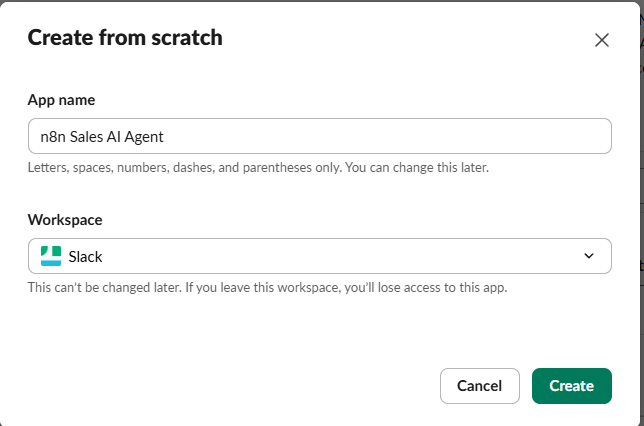

---

## 4. OAuth Scope を設定する

作成した Slack App の、

```text
OAuth & Permissions
```

を開きます。


`Bot Token Scopes` から、Bot に必要な権限を追加します。

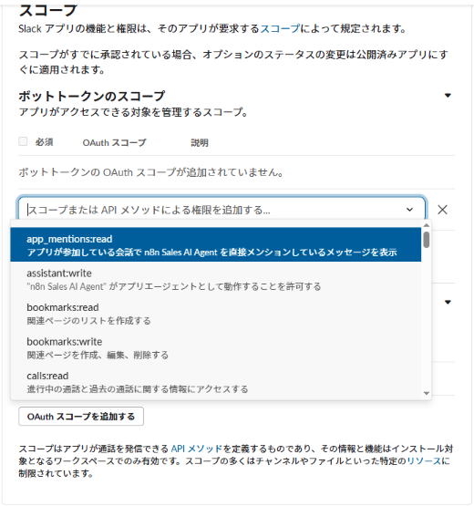

この Lesson では最終的に、次の Scope を利用します。

Scope 用途

---

`app_mentions:read` Bot へのメンションを受信する
`channels:read` Public Channel の情報を取得する
`chat:write` Slack へメッセージを投稿する
`groups:read` Private Channel の情報を取得する
`users:read` User 情報を取得する

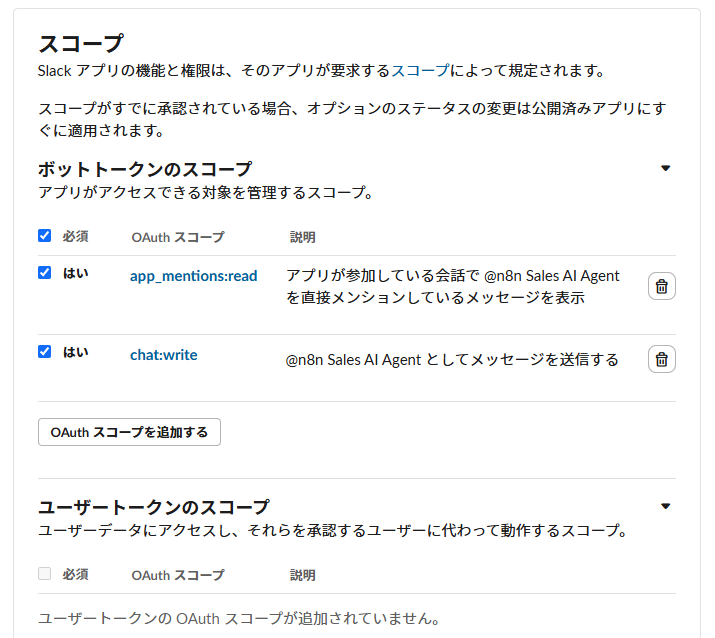

Scope を設定したら Slack App を Workspace
にインストールし、要求される権限を確認して許可します。

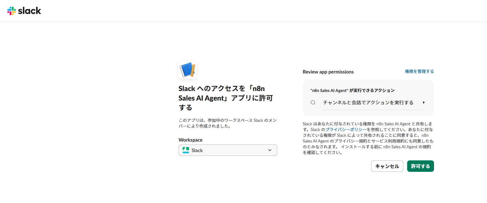

Slack App で取得した認証情報を n8n の Credential に設定します。


Credential が接続されると Slack Trigger から利用できるようになります。


---

## 5. Webhook と Cloudflare Tunnel の仕組み

今回の Slack Trigger は **Webhook** を利用します。

Webhook とは、あるサービスでイベントが発生したときに、別のサービスへ HTTP リクエストを送り、処理を開始する仕組みです。

今回の通信経路は次のようになります。

```text
Slack
  │ app_mention イベント
  ↓
公開 HTTPS URL
  ↓
Cloudflare Tunnel
  ↓
http://localhost:5678
  ↓
n8n
  ↓
Slack Trigger
```

### 5-1. localhost のままでは Slack からアクセスできない

この教材では、n8n Community Edition をローカル PC の Docker 上で実行しています。

Slack Trigger の Webhook URL は、最初は `localhost` を使用しています。

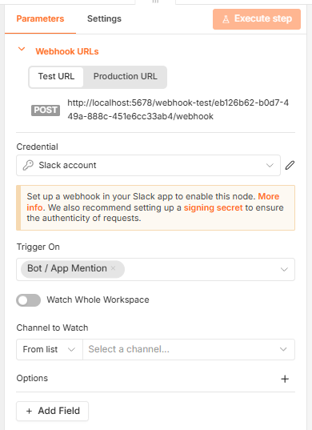

`localhost` はその PC 自身を表すため、インターネット上の Slack から受講者の PC の `localhost:5678` へ直接アクセスすることはできません。

そこで **Cloudflare Tunnel** を利用して、インターネットからローカル n8n へ到達できる公開 HTTPS URL を作ります。

### 5-2. cloudflared を Windows にインストールする

PowerShell を開き、次のコマンドを実行します。

```powershell
winget install --id Cloudflare.cloudflared
```

インストール後は PowerShell を開き直し、次のコマンドで確認します。

```powershell
cloudflared --version
```

バージョン情報が表示されれば準備完了です。

> **NOTE:** `cloudflared` が認識されない場合は PowerShell をいったん閉じて開き直してください。

### 5-3. n8n を起動する

n8n のプロジェクトフォルダーへ移動し、Docker Compose で起動します。

```powershell
cd C:\Users\<ユーザー名>\n8n-ai-agent
docker compose up -d
```

起動状態を確認します。

```powershell
docker compose ps
```

ブラウザで次の URL を開き、n8n が表示されることを確認します。

```text
http://localhost:5678
```

> **IMPORTANT:** `<ユーザー名>` やプロジェクトフォルダーは、自分の環境に合わせて変更してください。

### 5-4. Cloudflare Quick Tunnel を起動する

n8n が起動した状態で、**別の PowerShell** を開いて次のコマンドを実行します。

```powershell
cloudflared tunnel --url http://localhost:5678
```

Cloudflare Tunnel が起動すると、次のような公開 URL が表示されます。

```text
https://xxxxx.trycloudflare.com
```

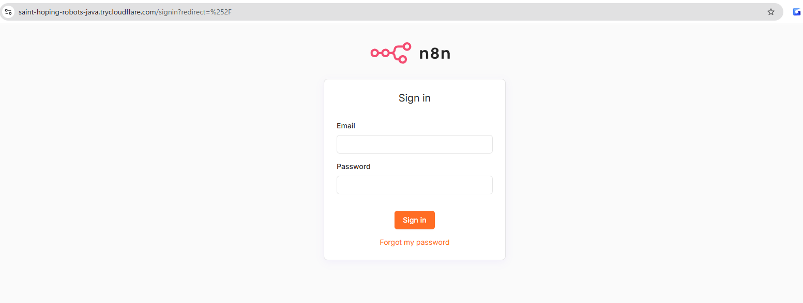

この URL は後ほど `compose.yaml` と Slack の設定で使用するため、コピーしておきます。

> [!IMPORTANT]
> 教材のスクリーンショットに表示されている URL をコピーするのではなく、必ず自分の PowerShell に表示された `trycloudflare.com` の URL を使用してください。

### 5-5. compose.yaml に WEBHOOK_URL を設定する

Cloudflare Tunnel の公開 URL を取得しただけでは、n8n が生成する Webhook URL は自動的には切り替わりません。

n8n に「外部からアクセスされる公開 URL」を知らせるため、プロジェクト直下の `compose.yaml` を編集します。

GitHub で公開する `compose.yaml` には、受講者ごと・起動ごとに変わり得る Quick Tunnel の URL は固定していません。

この教材の `environment:` は、変更前は次のようになっています。

```yaml
environment:
  - GENERIC_TIMEZONE=Asia/Tokyo
  - TZ=Asia/Tokyo
  - N8N_ENFORCE_SETTINGS_FILE_PERMISSIONS=true
  - N8N_RUNNERS_ENABLED=true
```

ここへ `WEBHOOK_URL` を追加します。

```yaml
environment:
  - GENERIC_TIMEZONE=Asia/Tokyo
  - TZ=Asia/Tokyo
  - N8N_ENFORCE_SETTINGS_FILE_PERMISSIONS=true
  - N8N_RUNNERS_ENABLED=true
  - WEBHOOK_URL=https://xxxxx.trycloudflare.com/
```

`https://xxxxx.trycloudflare.com/` の部分は、先ほど Cloudflare Tunnel が発行した **自分の URL** に置き換えてください。

今回の構築時には、例えば次の形式で設定しました。

```yaml
- WEBHOOK_URL=https://<Cloudflare-Tunnelで発行されたURL>/
```

> [!IMPORTANT] > `WEBHOOK_URL` は Cloudflare Tunnel の公開 URL と一致させます。教材作成者の URL や他の受講者の URL は使用できません。

### 5-6. compose.yaml の変更を n8n に反映する

`compose.yaml` を保存したら、n8n コンテナを再作成して環境変数を反映します。

```powershell
docker compose down
docker compose up -d
```

起動状態も確認します。

```powershell
docker compose ps
```

n8n をブラウザで開き、Slack Trigger の Webhook URL を確認します。

`localhost:5678` ではなく、Cloudflare Tunnel の公開 URL が使用されていれば設定成功です。

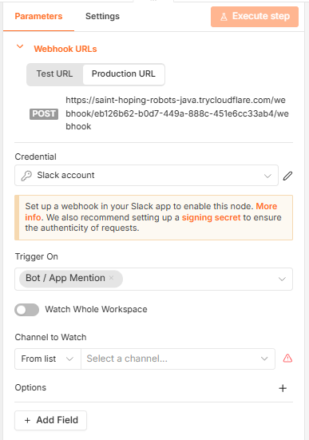

ここまでの作業順序を整理すると、次のようになります。

```text
Docker / n8n を起動
        ↓
Cloudflare Tunnel を起動
        ↓
https://xxxxx.trycloudflare.com を取得
        ↓
compose.yaml に WEBHOOK_URL を追加
        ↓
n8n コンテナを再作成
        ↓
Slack Trigger の Webhook URL を確認
        ↓
Slack Event Subscriptions に登録
```

### 5-7. n8n と Cloudflare Tunnel は両方とも起動し続ける

今回の構成では、Slack Sales AI Agent を利用している間、次の **両方が動いている必要があります**。

```text
Slack
  ↓
Cloudflare
  ↓
cloudflared  ← 起動している必要がある
  ↓
localhost:5678
  ↓
Docker / n8n ← 起動している必要がある
  ↓
Published Workflow
```

`cloudflared tunnel --url http://localhost:5678` を実行している PowerShell を閉じたり、`Ctrl + C` を押したりすると Tunnel は停止します。

Tunnel が停止すると Slack からローカル n8n へイベントを届けられません。

### 5-8. 翌日・PC 再起動後の注意

Quick Tunnel を停止して再度起動すると、`trycloudflare.com` の URL が変わる場合があります。

```text
前回
https://aaaa-bbbb.trycloudflare.com

        ↓ PC再起動 / Tunnel再起動

今回
https://cccc-dddd.trycloudflare.com
```

URL が変わった場合は、**Cloudflare Tunnel を起動し直すだけでは不十分**です。

次の順序で設定を更新します。

```text
1. Docker / n8n を起動する
2. Cloudflare Tunnel を起動する
3. 新しい trycloudflare.com URL を確認する
4. compose.yaml の WEBHOOK_URL を新しい URL に変更する
5. docker compose down を実行する
6. docker compose up -d を実行する
7. n8n の Webhook URL が新しい URL になったことを確認する
8. Slack Event Subscriptions の Request URL も更新する
9. Verified を確認して Save Changes
10. Slack から動作確認する
```

つまり、このローカル構成では、

```text
Cloudflare URL
      │
      ├── compose.yaml の WEBHOOK_URL
      │
      └── Slack Event Subscriptions の Request URL
```

の整合性が重要です。

> [!NOTE]
> Quick Tunnel は学習・開発環境で手軽に Webhook を試すための構成です。PC や Tunnel を停止すると利用できなくなります。24 時間運用する場合は、常時インターネットから到達できる n8n 環境や正式な Tunnel 構成を検討します。

---

## 6. Slack Event Subscriptions を設定する

Slack App の `Event Subscriptions` を開き、`Enable Events` を ON
にします。


今回の構成では Request URL を利用するため、Socket Mode は OFF にします。

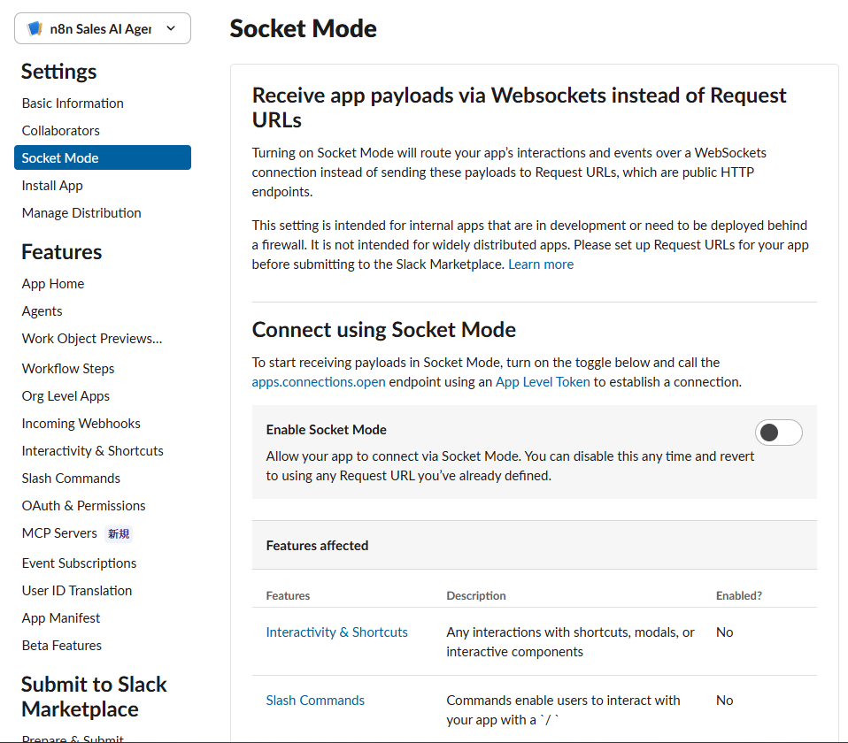

Request URL に n8n Slack Trigger の Test URL を設定します。


### Request URL が Verified にならない場合

設定途中では、次のように URL verification が失敗する場合があります。


Slack は Request URL が正しく応答できるか確認します。

このエラーが発生した場合は、次の点を確認します。

- Cloudflare Tunnel が起動しているか
- n8n の Webhook URL が公開 URL になっているか
- Slack Trigger がテストイベントを受信できる状態か
- Socket Mode が今回の構成と競合していないか
- Test URL と Production URL を混同していないか

エラー画面も重要な学習ポイントです。

Webhook 連携では、**外部サービスから n8n へ到達できる URL
が必要**であることを理解してください。

---

## 7. Channel 一覧を取得できない問題を解決する

Slack Trigger で Channel
を選択するとき、次のエラーが発生する場合があります。

```text
Could not load list

Your Slack credential is missing required OAuth Scopes
```


これは Slack App に必要な OAuth Scope が不足しているためです。

`OAuth & Permissions` に戻り、`channels:read` など必要な Scope
を追加します。


Slack では Scope を変更しただけでは、すでにインストール済みの App
へ新しい権限が反映されません。

そのため、

```text
Reinstall to Workspace
```

を実行します。

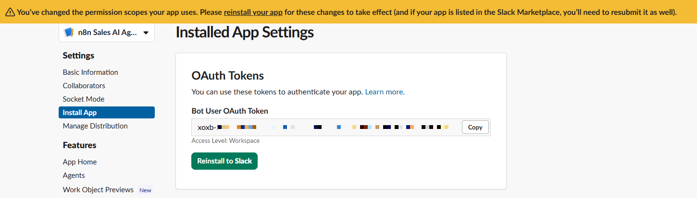

再インストール後、新しい Scope が反映されます。


この点は Slack API 連携で重要です。

```text
Scopeを追加
     ↓
Reinstall to Workspace
     ↓
新しい権限が反映
```

---

## 8. Sales AI Agent 用 Channel を作成する

Slack に専用 Channel を作成します。

Channel 名は、

```text
sales-ai-agent
```

とします。


作成した Channel に `n8n Sales AI Agent` App を追加します。


---

## 9. app_mention イベントを購読する

n8n の Slack Trigger が受信可能な状態になると、Slack Event Subscriptions
の Request URL が、

```text
Verified
```

になります。


次に `Subscribe to bot events` へ、

```text
app_mention
```

を追加します。

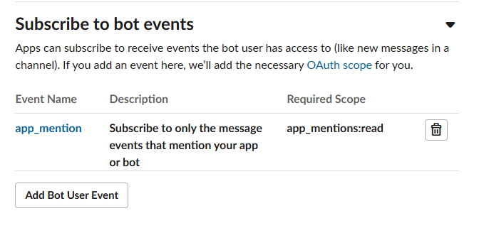

> \[!IMPORTANT\] Event を追加した後は、Slack 側の `Save Changes`
> まで実行してください。Event を追加しただけでは設定が反映されません。

n8n を Test URL の待受状態にして、Slack から Bot をメンションします。

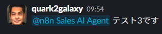

Slack Trigger がイベントを受信すると、OUTPUT に Slack から送られた JSON
が表示されます。


ここには、

- メッセージ本文
- Channel
- User
- Event 情報

などが含まれます。

これで、

```text
Slack
  ↓
Slack Trigger
```

の連携ができました。

---

## 10. AI Agent を追加する

Slack Trigger の後ろに AI Agent を追加します。

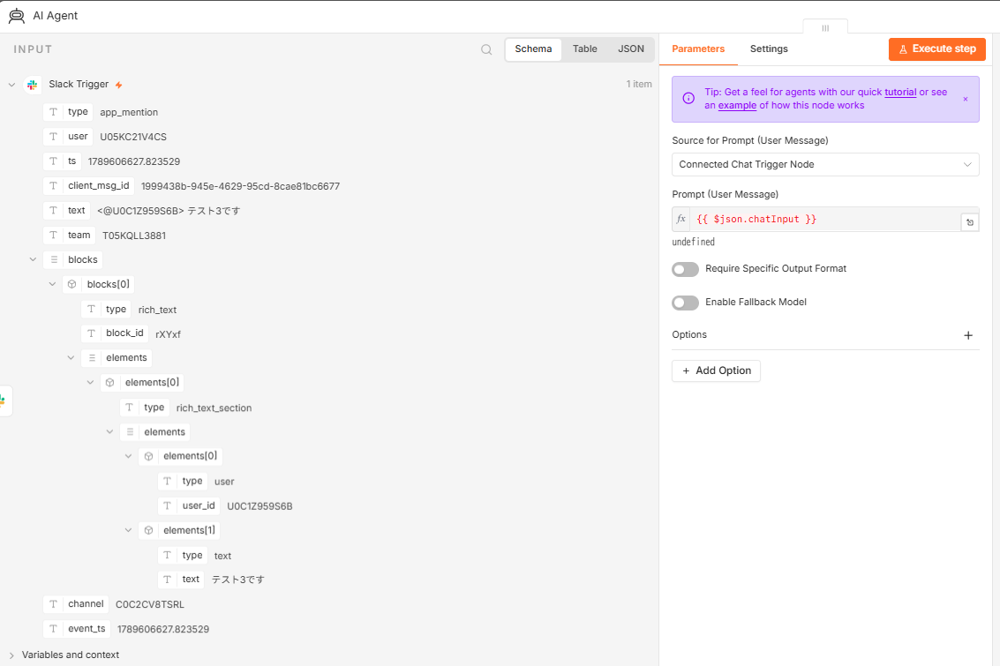

今回は Chat Trigger ではなく Slack Trigger を使用しているため、Prompt
の入力元を自分で設定します。

Slack Trigger の `text` を AI Agent の Prompt へ渡します。

```text
{{ $json.text }}
```


これによって、Slack で入力されたメッセージが AI Agent の User Message
になります。

---

## 11. Google Gemini Chat Model を接続する

AI Agent の `Chat Model` から、

```text
Google Gemini Chat Model
```

を選択します。


Lesson 04 以降で使用した Credential を再利用し、Gemini Model
を設定します。


AI Agent と Gemini Chat Model が接続されます。

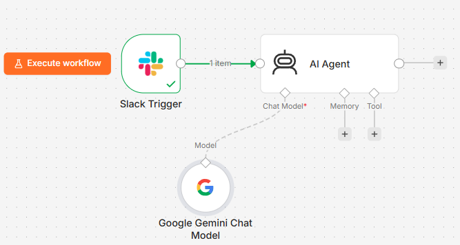

AI Agent を実行し、Slack
のメッセージから回答を生成できることを確認します。


---

## 12. AI の回答を Slack へ送信する

次に AI Agent の回答を Slack へ返します。

AI Agent の後ろに Slack Node を追加し、

```text
Send a message
```

を選択します。


送信先 Channel を、

```text
sales-ai-agent
```

に設定します。

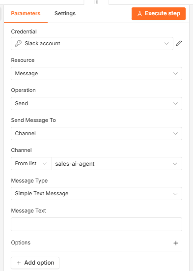

Message Text には AI Agent の `output` を設定します。

```text
{{ $json.output }}
```


Node を実行すると、Slack に AI の回答が投稿されます。

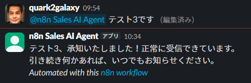

---

## 13. Workflow 全体をテストする

この時点の Workflow は次の構成です。

```text
Slack Trigger
      ↓
   AI Agent
      │
      └── Google Gemini Chat Model
      ↓
Slack
Send a message
```


Test URL を利用している間は、n8n の、

```text
Execute workflow
```

を実行して待受状態にしてから Slack でメンションします。

すべての Node が成功すれば、Slack から AI Agent
まで一連の処理が動作しています。


Slack にも回答が表示されます。


---

## 14. Test URL と Production URL の違い

ここまで使用した Test URL は、Workflow の開発・動作確認用です。

```text
Test URL
   ↓
Execute workflow で待受
   ↓
Slackからイベント送信
```

実際の運用では、毎回 `Execute workflow` を押すことはできません。

そこで Production URL を利用します。

Slack Trigger の Production URL を確認します。


Production URL を利用するには Workflow を Publish します。

Version name の例：

```text
Slack Sales AI Agent v1
```


Publish が完了すると Workflow がイベントを待ち受ける状態になります。

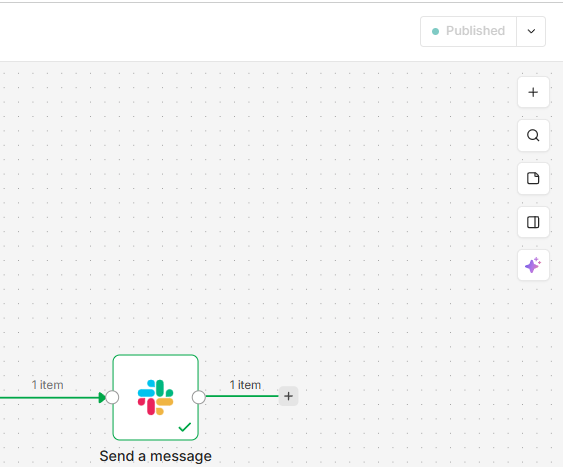

Slack Event Subscriptions の Request URL を Production URL に変更し、

```text
Verified
```

になることを確認します。

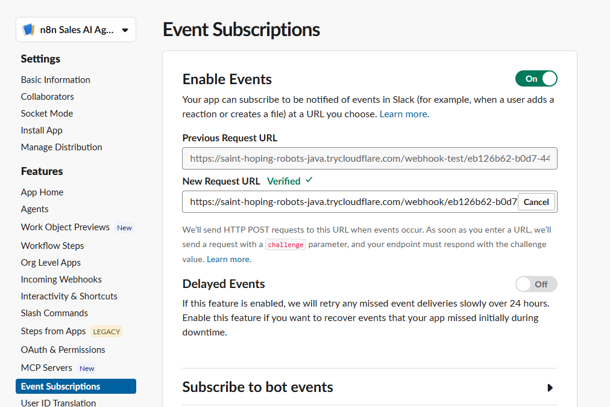

これで `Execute workflow` を押さなくても、Slack からのメンションで
Workflow が自動実行されます。

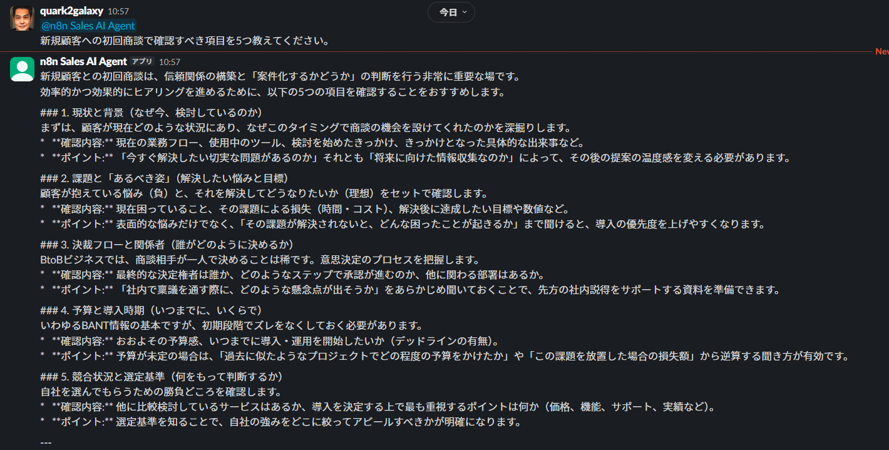

この違いは Webhook 型 Workflow を運用するうえで重要です。

URL 用途 Execute workflow

---

Test URL 開発・テスト 必要
Production URL 通常運用 不要

---

## 15. System Message で Sales AI Agent の役割を定義する

現在の Agent でも回答はできますが、営業支援 AI
としての役割や回答形式が十分に定義されていません。

AI Agent の `Options` から、

```text
System Message
```

を追加します。


System Message には次のような指示を設定します。

```text
あなたは法人営業担当者を支援する「Sales AI Agent」です。

ユーザーからの営業に関する質問や依頼に対して、
実務でそのまま活用できる具体的な回答を提供してください。

主な支援内容：
・営業メールや提案文の作成
・初回商談やヒアリングの準備
・顧客課題の整理
・提案内容や営業施策のアイデア出し
・商談後のフォローアップ文面の作成

回答するときは、以下のルールを守ってください。
・日本語で回答してください。
・結論や重要な内容を先に示してください。
・具体的で実務に使いやすい内容にしてください。
・必要に応じて箇条書きを使用してください。
・Slackで読みやすい簡潔な文章にしてください。
・「###」や「**」などのMarkdown記号は使用しないでください。
・不明な情報を事実として作らないでください。
・顧客名、商品、価格など必要な情報が不足している場合は、
  必要に応じて確認してください。
```


変更後、Workflow を v2 として Publish します。


Slack から質問すると、営業支援用途に合わせた回答が生成されます。


System Message は、AI Agent に、

> **「どのような役割で、どのようなルールに従って振る舞うか」**

を定義するために利用できます。

---

## 16. Slack のメンション ID を Prompt から除去する

Slack Trigger の `text` には、ユーザーが入力した本文だけでなく、Bot
のメンション ID も含まれます。

概念的には次のようなデータです。

```text
<@UXXXXXXXX> 生成AI研修を検討している企業への
初回ヒアリング質問を3つ作ってください。
```

AI Agent には質問本文だけを渡したいため、Prompt の Expression
を変更します。

```text
{{ $json.text.replace(/<@[^>]+>/g, "").trim() }}
```

`replace()` で `<@...>` の部分を取り除き、`trim()`
で前後の空白を削除しています。

Result にメンション ID
が含まれず、質問本文だけになっていることを確認します。


変更後、Workflow を v3 として Publish します。


---

## 17. Production 環境で最終テストする

Slack から次のような質問を送信します。

```text
@n8n Sales AI Agent
生成AI研修を検討している企業への
初回ヒアリング質問を3つ作ってください。
```

`Execute workflow` を押さなくても Sales AI Agent が自動的に回答します。


n8n の Executions では、

```text
Slack Sales AI Agent v3
```

が実行され、

- Slack Trigger
- AI Agent
- Google Gemini Chat Model
- Slack Send a message

がすべて正常終了していることを確認できます。


---

## 18. 今回の Workflow と AI Agent の役割

今回の構成を整理します。

```text
Slack
  │
  │ app_mention
  ↓
Slack Trigger
  │
  │ text
  ↓
AI Agent
  │
  └── Google Gemini Chat Model
  │
  │ output
  ↓
Slack
Send a message
  │
  ↓
Slack Channel
```

ここで重要なのは、それぞれの役割が異なることです。

| 要素                 | 役割                                            |
| -------------------- | ----------------------------------------------- |
| Slack                | ユーザーとの業務インターフェース                |
| Slack Trigger        | Slack のイベントを n8n へ取り込む               |
| AI Agent             | User Message と System Message をもとに処理する |
| Gemini Chat Model    | 自然言語を理解・生成する LLM                    |
| Slack Send a message | AI Agent の結果を Slack へ返す                  |

Lesson 03 では Gemini を通常の Workflow から直接呼び出しました。

Lesson 04 では Gemini を AI Agent の Chat Model として接続しました。

Lesson 07 では、その AI Agent をさらに
**実際の業務コミュニケーションツールである Slack へ接続**しました。

```text
Lesson 03
Workflow → Gemini

Lesson 04
Workflow → AI Agent → Gemini Chat Model

Lesson 07
Slack → Workflow → AI Agent → Gemini Chat Model → Slack
```

AI Agent を業務で利用するためには、LLM だけでなく、

> **ユーザーや業務システムと AI Agent をどのようにつなぐか**

も重要になります。

---

## 19. Lesson 07 のまとめ

この Lesson では、

- Slack App の作成
- OAuth Scope の設定
- n8n Slack Credential
- Cloudflare Tunnel による Webhook の外部公開
- Event Subscriptions
- `app_mention`
- Slack Trigger
- AI Agent
- Google Gemini Chat Model
- Slack への自動返信
- Test URL / Production URL
- Workflow の Publish
- System Message
- Slack メンション ID の除去

を実装しました。

また、実装中のトラブルから、

- OAuth Scope を追加したら App の Reinstall が必要
- Webhook は外部サービスから到達できる URL が必要
- Test URL と Production URL では動作方法が異なる
- Event Subscription は `Save Changes` まで必要

という、外部サービス連携で重要なポイントも確認しました。

これで、n8n の AI Agent を Slack から利用できるようになりました。

次の Lesson では、ここまで学んだ Workflow、AI Agent、Tool
Calling、Human-in-the-loop、外部サービス連携を組み合わせ、営業業務で利用できる
AI Agent へ発展させます。
