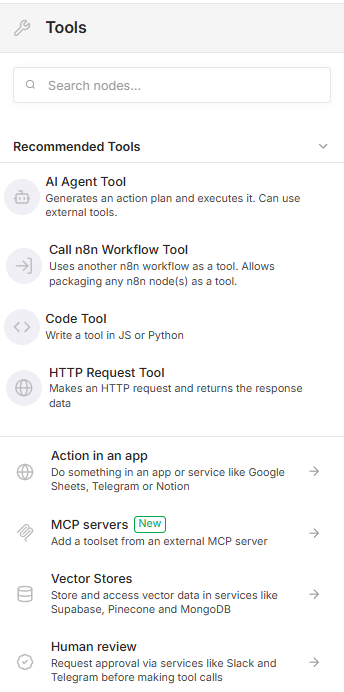
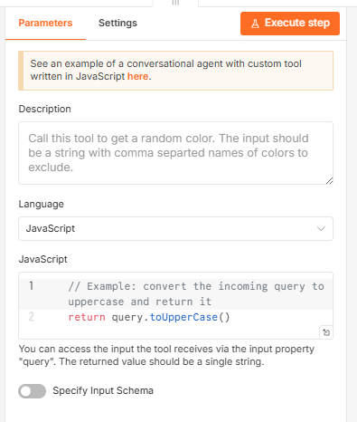
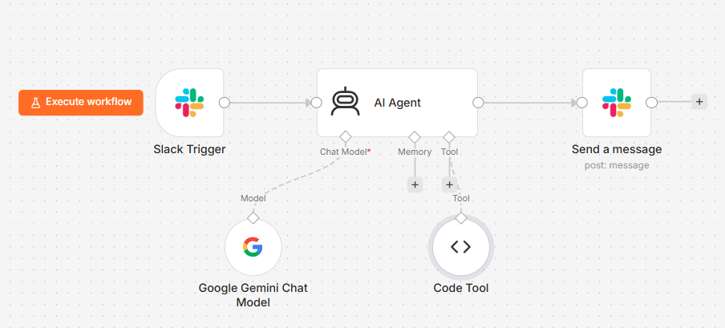
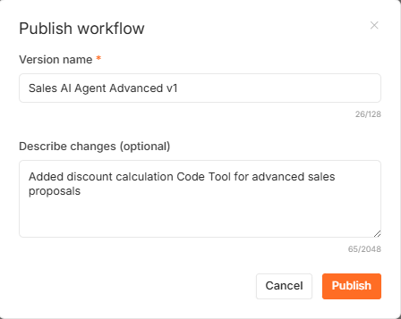
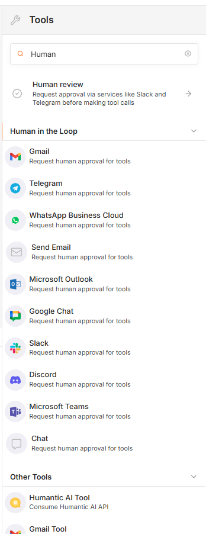
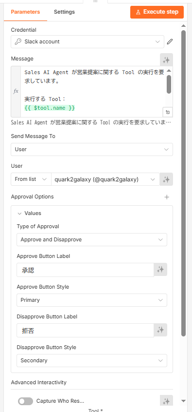
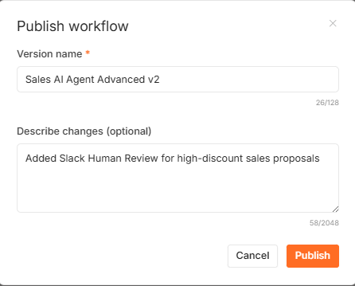
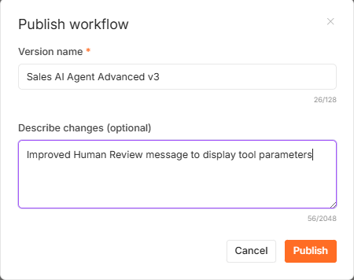

# Lesson 08：営業提案 AI Agent 完成・発展演習

Lesson 07 では、Slack から AI Agent を呼び出し、Gemini
が営業提案を生成して Slack に返信する Sales AI Agent を構築しました。

Lesson 08 では、この Workflow をさらに発展させます。

今回のポイントは、AI Agent に単に文章を生成させるだけではなく、

- 計算が必要な場合は Code Tool を利用する
- 高率な値引きを伴う提案では Human Review を要求する
- 承認された場合だけ処理を続行する
- 拒否された場合は AI Agent が代替案を提示する

という、**Tool Calling と Human-in-the-loop を組み合わせた営業 AI
Agent** を構築することです。

---

## 1. この Lesson で作るもの

完成する Workflow の基本構成は次のとおりです。

```text
Slack
  ↓
Slack Trigger
  ↓
AI Agent
  ├─ Google Gemini Chat Model
  ├─ Code Tool（通常の値引き計算）
  └─ Human Review（Slack）
       ↓
       Code Tool1（高率値引きの計算）
  ↓
Send a message
  ↓
Slack
```

通常の値引き計算は AI Agent が Tool を利用して自動処理します。

一方、20%以上の高率値引きを含む営業提案では、人間による承認・拒否を挟みます。


> [!NOTE] この Lesson は Lesson 07 で作成した Slack Sales AI Agent
> を発展させる演習です。Slack App、Cloudflare Tunnel、Gemini Credential
> などの基本設定は Lesson 07 で完了していることを前提とします。

---

## 2. なぜ Tool Calling が必要なのか

LLM は文章生成を得意としますが、金額計算のような処理まで常に LLM
自身へ任せる必要はありません。

そこで、計算処理を Code Tool として切り出します。

AI Agent はユーザーの依頼内容を判断し、必要なときに Tool
を呼び出します。

```text
ユーザー
  ↓
AI Agent
  ↓
「計算が必要」
  ↓
Code Tool
  ↓
計算結果
  ↓
AI Agent
  ↓
営業提案を生成
```

この構成により、**AI に判断を任せながら、計算などの処理は専用 Tool
に担当させる**ことができます。

---

## 3. 通常の値引き計算用 Code Tool を追加する

AI Agent の `Tool` から Tool を追加します。



`Code Tool` を選択します。



### Description を設定する

AI Agent は Description を参考にして、「どの Tool
を、いつ使うべきか」を判断します。

そのため、Description は単なるメモではなく、AI Agent にとって重要な Tool
の利用説明です。


値引き計算用 Tool
では、金額と値引率を受け取り、値引き後の金額を計算することを明確にします。

### JavaScript を設定する

Code Tool では、入力された金額と値引率から値引き後の金額を計算します。

```javascript
const [amount, discountRate] = query.split(",").map(Number);

const discountedAmount = amount * (1 - discountRate / 100);

return JSON.stringify({
  originalAmount: amount,
  discountRate: discountRate,
  discountedAmount: discountedAmount,
});
```


> [!IMPORTANT] AI Agent が Tool に渡す入力形式と、Code Tool
> が想定する入力形式を一致させる必要があります。この例では `850000,10`
> のような「金額,値引率」の文字列を想定しています。

Code Tool を AI Agent の Tool として接続します。



---

## 4. 値引き計算を Slack からテストする

Slack から次のように依頼します。

```text
@n8n Sales AI Agent
850,000円の商品を10%値引きした場合の金額を計算し、その金額を使った営業提案を作成してください。
```

AI Agent は Code Tool
を利用して値引き後の金額を計算し、その結果を営業提案へ利用します。


この時点で、

```text
850,000円 × (1 - 0.10)
= 765,000円
```

という計算結果を営業提案へ反映できています。

---

## 5. Test URL と Production URL を整理する

Slack Trigger のような Webhook 型 Trigger では、Test URL と Production
URL の違いを理解することが重要です。

### Test URL

Test URL は、n8n Editor で `Execute workflow`
を実行し、テスト待受状態にしている間に利用します。


### Production URL

Workflow を常時 Slack から利用する場合は Production URL を使用します。


> [!IMPORTANT] Slack App の Event Subscriptions に登録する Request URL
> は、実際に利用する Workflow の Production URL と一致させます。
>
> Workflow を複製すると Webhook の識別部分が変わることがあります。Lesson
> 07 の Workflow を複製して Lesson 08 を作成した場合は、Lesson 08 側の
> Production URL を確認してください。

---

## 6. Advanced Workflow を Publish する

Production Trigger を利用するため、Workflow を Publish します。



Publish 後、n8n は Slack からのイベントを待ち受けます。


---

## 7. Slack Event Subscriptions の Request URL を更新する

Slack App の `Event Subscriptions` を開きます。

Lesson 07 の Request URL が残っている場合は、Lesson 08 の Production URL
に変更します。


新しい Request URL を入力すると、Slack が URL Verification
を実行します。


`Verified` を確認して設定を保存します。


> [!NOTE] Cloudflare Quick Tunnel を利用している場合、Tunnel
> を再作成すると `trycloudflare.com`
> のホスト名が変わることがあります。その場合は n8n の `WEBHOOK_URL` と
> Slack Event Subscriptions の Request URL の両方を更新します。

---

## 8. Production 環境で Code Tool の実行を確認する

Slack から値引き依頼を送信し、Production Workflow
が自動実行されることを確認します。


Executions では、AI Agent から Code Tool
が呼び出されたことを確認できます。


ここで重要なのは、単に Slack
に正しい回答が表示されたことだけではありません。

**Executions を確認し、AI Agent が実際に Tool
を選択して実行したことを確認する**ことが大切です。

---

## 9. Human Review を追加する

営業業務では、すべてを AI に自動実行させることが適切とは限りません。

特に大幅な値引きなど、企業として承認が必要な処理では、人間の確認を挟む設計が有効です。

AI Agent の Human review から Slack を選択します。



Slack の `Send and wait` が Human Review ノードとして追加されます。


---

## 10. 承認者を設定する

Human Review の通知先を設定します。

この演習では `Send Message To` を `User` とし、承認を担当する Slack
ユーザーを指定します。


実務では、営業責任者、マネージャー、部門責任者などを承認者として設定することが考えられます。

---

## 11. Human Review のメッセージを設定する

承認者には、「AI
が何を実行しようとしているか」が分かる情報を提示します。

最終版では次の Message を使用します。

```text
Sales AI Agent が営業提案に関する Tool の実行を要求しています。

実行する Tool：
{{ $tool.name }}

入力内容：
{{ JSON.stringify($tool.parameters, null, 2) }}

内容を確認し、実行を承認または拒否してください。
```


`$tool.name` では実行対象の Tool 名を表示します。

`$tool.parameters` はオブジェクトであるため、そのまま表示すると
`[object Object]` になる場合があります。

そこで、

```javascript
JSON.stringify($tool.parameters, null, 2);
```

を利用して、承認者が確認できる JSON 形式へ変換します。

> [!IMPORTANT] Human-in-the-loop
> では、単に「承認しますか？」と聞くだけでは不十分です。可能な範囲で、承認対象・入力内容・実行内容を人間が判断できる形で提示します。

---

## 12. 承認・拒否ボタンを設定する

`Type of Approval` を次の設定にします。

```text
Approve and Disapprove
```


ボタン名は日本語に変更します。

```text
Approve Button Label：承認
Disapprove Button Label：拒否
```



これにより、Slack 上で承認者が処理を明示的に判断できます。

---

## 13. Human Review の後に実行する Tool を追加する

Human Review の `Tool` から Code Tool を追加します。


Human Review と AI Agent が接続された状態を確認します。


---

## 14. 高率値引き用 Code Tool を設定する

Human Review の後で実行する Code Tool を設定します。


Description には、この Tool
が高率値引きの営業提案で使用され、人間の承認後に実行されることを記述します。


JavaScript
では値引き後の金額を計算し、承認済みであることも結果へ含めます。

```javascript
const [amount, discountRate] = query.split(",").map(Number);

const discountedAmount = amount * (1 - discountRate / 100);
const discountAmount = amount - discountedAmount;

return JSON.stringify({
  approved: true,
  originalAmount: amount,
  discountRate: discountRate,
  discountAmount: discountAmount,
  discountedAmount: discountedAmount,
  message: "高率値引きの営業提案が承認されました",
});
```


Human Review の Tool として接続します。


---

## 15. AI Agent に値引きルールを追加する

AI Agent の System Message
に、通常値引きと高率値引きの扱いを追加します。

考え方は次のとおりです。

```text
値引き率が20%未満
    ↓
通常の値引き計算用 Code Tool
    ↓
営業提案を作成

値引き率が20%以上
    ↓
Human Review
    ↓
人間が承認
    ↓
高率値引き用 Code Tool
    ↓
営業提案を作成
```


> [!WARNING] この演習では AI Agent の System Message と Tool
> Description を使って Tool の選択方針を与えています。
>
> これは AI Agent
> の判断を学習する教材として有効ですが、**厳密な業務統制そのものではありません**。
>
> 本番業務で「20%以上は必ず承認」のようなルールを強制する場合は、IF /
> Switch、別
> Workflow、承認システム、権限制御など、決定論的な仕組みでもルールを保証する設計を検討してください。

---

## 16. v2 を Publish する

Human Review を追加した Workflow を Publish します。



---

## 17. 10%値引き：Human Review を通らないことを確認する

まず 10%値引きを依頼します。

```text
@n8n Sales AI Agent
850,000円の商品を10%値引きした場合の金額を計算し、その金額を使った営業提案を作成してください。
```

10%は通常値引きとして処理され、Human Review
を要求せず営業提案が返ります。


Executions でも通常の Code Tool が利用されていることを確認します。


このテストにより、Human Review
を追加したからといって、すべての処理が承認待ちになるわけではないことを確認できます。

---

## 18. 20%値引き：Human Review が起動することを確認する

次に 20%値引きを依頼します。

```text
@n8n Sales AI Agent
850,000円の商品を20%値引きした場合の金額を計算し、その金額を使った営業提案を作成してください。
```

20%の高率値引きでは、Slack DM に承認要求が届きます。


承認者は `承認` または `拒否` を選択できます。

---

## 19. 承認した場合の動作を確認する

`承認` をクリックすると、Human Review が完了します。


承認後、高率値引き用 Code Tool
が実行され、20%値引き後の金額を使った営業提案が Slack に返ります。

```text
850,000円 × (1 - 0.20)
= 680,000円
```


Executions では Human Review と高率値引き用 Code Tool
の実行を確認できます。


この実行は、

```text
AI が高率値引きを判断
    ↓
人間へ承認要求
    ↓
人間が承認
    ↓
Tool 実行
    ↓
営業提案生成
```

という Human-in-the-loop の一連の流れです。

---

## 20. 拒否した場合の動作を確認する

同じ 20%値引き依頼に対して、今度は `拒否` を選択します。

AI Agent
は 20%値引きを確定価格として提案せず、値引率を下げる、通常価格で再提案する、別の付加価値を検討する、といった代替案を提示します。


Executions でも Human Review が行われたことを確認できます。


> [!IMPORTANT] Human Review
> の価値は「人間が承認できる」ことだけではありません。
>
> **拒否された場合に AI Agent
> がその結果を受け取り、次の行動を考えられる**ことも AI Agent 型
> Workflow の重要な特徴です。

---

## 21. Tool の入力内容を承認者へ表示する

初期設定では `$tool.parameters` をそのまま Message に埋め込むと、Slack
で次のように表示される場合があります。

```text
[object Object]
```

これは Tool Parameters が JavaScript のオブジェクトだからです。

そこで Message を次のように変更します。

```text
入力内容：
{{ JSON.stringify($tool.parameters, null, 2) }}
```


変更を Publish します。



再度 20%値引きを依頼すると、Slack の承認画面で Tool
の入力内容を確認できるようになります。


今回の例では次のような情報が表示されます。

```json
{
  "input": "850000,20"
}
```

これにより、承認者は AI Agent がどの値を Tool
へ渡そうとしているのか確認できます。

---

## 22. 最終版を Publish する

Human Review Message を動作確認済みの状態へ確定し、最終版として Publish
します。


この Lesson の完成 Workflow
は、次の 3 つの重要な要素を組み合わせています。

```text
Tool Calling
+
Human-in-the-loop
+
Slack / Webhook
```

---

## 23. 完成した AI Agent の判断フロー

最終的な処理の考え方を整理します。

```text
Slack から営業依頼
        ↓
Slack Trigger
        ↓
AI Agent
        ↓
値引き計算が必要か？
        ↓
     必要
        ↓
値引率を判断
   ┌───────────────┴───────────────┐
   ↓                               ↓
20%未満                         20%以上
   ↓                               ↓
Code Tool                    Human Review
   ↓                               ↓
計算                            Slack DM
   ↓                         ┌─────┴─────┐
営業提案                      承認       拒否
                               ↓          ↓
                           Code Tool1   代替案を検討
                               ↓          ↓
                           営業提案      Slack返信
```

AI Agent は単に回答文を生成しているのではなく、**依頼内容に応じて Tool
と Human Review を使い分けるオーケストレーター**として動作します。

---

## 24. 実務で発展させる場合

この Workflow は営業 AI Agent の基本形です。

実務では、さらに次のような拡張が考えられます。

- Salesforce / HubSpot などから顧客情報を取得する
- SharePoint / Google Drive から商品資料を検索する
- 見積書を自動生成する
- 値引率に応じて承認者を変更する
- 承認履歴をデータベースへ保存する
- 営業提案をメール下書きとして作成する
- 顧客ごとの過去商談履歴を AI Agent に参照させる
- 高額案件では複数段階の承認を要求する

たとえば、承認ルールを次のように発展させることもできます。

```text
10%未満
  → 自動承認

10%以上20%未満
  → 営業マネージャー承認

20%以上
  → 部門責任者承認
```

このように、AI Agent
と業務ルールを組み合わせることで、単なるチャットボットではなく、**実際の業務プロセスへ組み込める
AI Agent**へ発展させられます。

---

## 25. Workflow を Export する

完成した Workflow は n8n から JSON として Export できます。

この教材では、公開用 Workflow を次のファイルとして保存する想定です。

```text
workflows/
└─ 07-sales-ai-agent-advanced.json
```

> [!WARNING] GitHub へ公開する前に、Workflow JSON に
> Credential、Credential ID、Webhook ID、Workflow ID、Instance ID、Slack
> Channel ID、個人を識別する Slack User ID、API
> キー、アクセストークンなどが含まれていないことを確認してください。

公開用 JSON では、環境固有情報を削除し、Import
後に受講者自身の環境で再設定する形式にします。

Import 後に再設定する主な項目は次のとおりです。

- Google Gemini API Credential
- Slack Credential
- Slack Channel
- Human Review の承認先ユーザー
- Slack Event Subscriptions の Request URL
- Cloudflare Tunnel / `WEBHOOK_URL`
- その他の環境依存設定

> [!NOTE] Workflow JSON
> は「完成品をそのまま動かすための秘密情報入りファイル」ではなく、**Workflow
> の構造・Node・接続・Expression・Prompt
> を再利用するための教材**として公開します。

---

## 26. Lesson 08 まとめ

この Lesson では、Lesson 07 の Slack Sales AI Agent
を発展させ、より実務的な AI Agent を構築しました。

学習したポイントは次のとおりです。

- AI Agent から Code Tool を利用する
- Tool Description が AI Agent の Tool 選択に影響する
- Slack Trigger の Test URL と Production URL を使い分ける
- Workflow の複製時には Production Webhook URL を確認する
- Human Review を AI Agent に接続する
- Slack DM で承認・拒否を行う
- 承認後だけ Tool を実行する
- 拒否結果を AI Agent が受け取り、代替案を生成する
- Tool Parameters を JSON 化して承認者へ提示する
- AI Agent の判断と、人間による業務統制を組み合わせる
- Executions から実際の Tool Calling を確認する

Lesson 02 から Lesson 08 までの流れを整理すると、次のようになります。

```text
通常の Workflow
        ↓
Gemini / LLM
        ↓
AI Agent
        ↓
Tool Calling
        ↓
Human-in-the-loop
        ↓
Slack / Webhook
        ↓
Tool Calling + Human Review を統合した業務 AI Agent
```

ここまでで、n8n を使った AI Agent の基礎から、外部サービス連携、Tool
Calling、人間による承認を含む実践的な Workflow
までを一通り構築できました。
